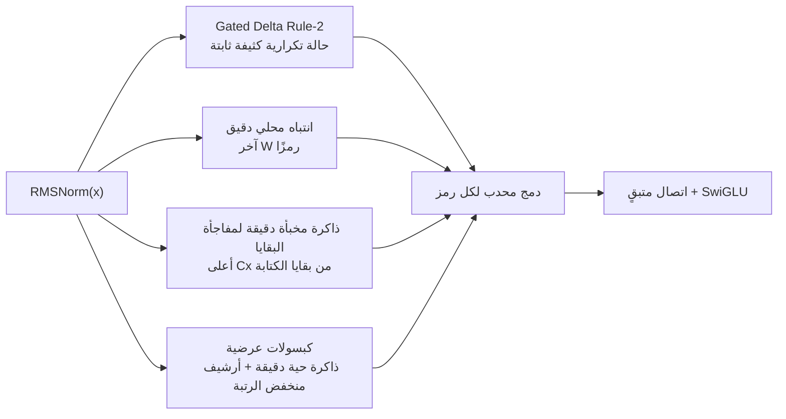

# ALUCLU

**Adaptive Layered Unified Context with Learned Updates**

<p align="center">
  <a href="README.md">English</a> ·
  <a href="README.tr.md">Türkçe</a> ·
  <a href="README.es.md">Español</a> ·
  <a href="README.ru.md">Русский</a> ·
  <a href="README.fr.md">Français</a> ·
  <a href="README.de.md">Deutsch</a> ·
  <strong>العربية</strong>
</p>

[ALUCLU](https://github.com/kaannsaydamm/ALUCLU)، التي صمّمها
Kaan Kadir Aluçlu، هي بنية بحثية من نوع decoder-only تجمع أربعة أنظمة فيزيائية
متميزة للذاكرة في كتلة واحدة قابلة للتعلّم، بدلاً من إجبار التدفقات الطويلة
على استخدام آلية ذاكرة واحدة.

> ضع السياق في طبقات، واضبط حدود الذاكرة، وقِس الاستدعاء.

## البنية



- يحمل `GatedDeltaRule2` في كل طبقة ذاكرة أوزان سريعة ثابتة الحجم.
- يطبّق `BoundedLocalAttention` دالة softmax سببية حقيقية عبر نافذة حديثة
  مهيكلة.
- يخزّن `ResidualSurpriseCache` الرموز ذات بقايا الكتابة المرتفعة في التحديث
  التكراري على هيئة مدخلات KV دقيقة بسعة ثابتة.
- يحتفظ `BoundedEpisodicMemory` بالمقاطع القريبة في صورة عوامل دقيقة،
  وبالمقاطع الأقدم في صورة كبسولات محدودة الرتبة باستخدام QR نحيف وSVD
  بنواة صغيرة.
- بعد طبقات RMSNorm منفصلة، تُدمج مخرجات مسارات الذاكرة بمعاملات متعلّمة لكل
  رمز، تكون موجبة ومجموعها يساوي واحدًا.

هذا المستودع هو واجهة خلفية محمولة للتحقق من صحة التنفيذ التكراري على مستوى
الرمز. وهو لا يدّعي توفير نواة GPU مدمجة، أو نموذج كبير مدرَّب، أو رقم قياسي
عالمي.

## التثبيت

يلزم Python 3.10 أو إصدار أحدث.

```powershell
python -m venv .venv
.\.venv\Scripts\python.exe -m pip install -e ".[test]"
```

في Linux وmacOS، يُستخدم `.venv/bin/python` في الأمر الأخير.

## أبسط استخدام

```python
import torch

from aluclu import AlucluLanguageModel, build_research_config

config = build_research_config(
    d_model=64,
    n_layers=4,
    local_window=64,
    segment_size=16,
    live_segments=16,
    archive_slots=4,
    archive_segments_per_slot=4,
    archive_rank=8,
    exact_cache_capacity=64,
)
model = AlucluLanguageModel(vocab_size=8192, config=config).eval()

state = None
token = torch.tensor([7])
logits, state = model.step(token, state)
```

تُنقل `state` صراحةً؛ ولا يُعاد ضبطها بصمت بين الاستدعاءات. إذا لم يكن مطلوبًا
الاحتفاظ برسم الحوسبة بين أجزاء التدريب، فتُستخدم
`model.detach_state(state)`.

## التحقق

بوابة الإصدار المحمول الكاملة:

```powershell
python scripts\validate_release.py
```

كل أمر على حدة:

```powershell
python -m pytest
aluclu-train-mqar --steps 200
aluclu-train-zoology-mqar --input-seq-len 64 --num-kv-pairs 4
aluclu-benchmark --torch-threads 1
```

تتوافر أيضًا أغلفة `scripts\*.py` للأوامر نفسها عند العمل من نسخة المصدر.

يستبعد `benchmark_stream.py` توليد الرموز العشوائية من نافذة التوقيت، ويقيس
prefill وrecurrent decode كلًّا على حدة. ولا تصح النتيجة إلا للعتاد والدقة
والنموذج والواجهة الخلفية المرجعية التي شُغلت عليها.

## بروتوكولا MQAR

- `generate_mqar_batch`: بروتوكول تشخيصي صغير للرمز التالي خاص بـ ALUCLU.
- `generate_zoology_mqar_batch`: دلالات الهدف الخاصة بالمولّد التاريخي لـ
  Zoology ICLR-2024، والمحاذاة عند موضع الاستعلام. لا يطبّق هذا المسار إزاحة
  إضافية للرمز التالي؛ بل يستخدم `zoology_mqar_loss`.

يسجّل `src/aluclu/protocols/zoology_iclr24_raw.json` بشفافية عدم تطابق Based
بين 4 طبقات/تكوينين في الوسم التاريخي.
ويعرّف `src/aluclu/protocols/zoology_iclr24_repaired_v1.json` أصغر إصلاح قابل
للتشغيل تحت هوية بروتوكول منفصلة.

## الحد الفيزيائي

الحد الأعلى المُهيّأ للأفق الزمني للذاكرة العرضية هو:

\[
T_{\mathrm{retained}}
=
\texttt{segment\_size}
\left(
1+\texttt{live\_segments}
+\texttt{archive\_slots}\,
\texttt{archive\_segments\_per\_slot}
\right).
\]

يمكن للذاكرة المخبأة الدقيقة للمفاجأة أن تحتفظ، بصورة مستقلة عن أفق العمر هذا،
بسجلات `capacity` الأعلى أولوية؛ ومع ذلك تظل سعتها محدودة. وبدقة عددية محدودة
وحالة فيزيائية ثابتة، يستحيل تذكّر عدد غير محدود من أزواج المفتاح والقيمة
المستقلة دون خطأ. وبدلاً من إخفاء هذا الحد، يجعل ALUCLU ميزانيات النافذة
والذاكرة المخبأة والرتبة والأرشيف ظاهرة في API.

## الوثائق

- `docs/ARCHITECTURE.md`: المعادلات، وتكلفة الحالة/الحوسبة، وسجل الأخطاء،
  والسببية، وأنماط الفشل.
- `docs/RESEARCH_REPORT_TR.md`: أدبيات عام 2026، والبدائل، وخطة القياس
  المعياري ودراسات الاستئصال.
- `docs/EXECUTION_PLAN_TR.md`: البوابات المكتملة، وترتيب التوسّع وبناء النوى،
  ومعايير الإيقاف.
- `docs/BRAND.md`: تسمية ALUCLU، والرسالة التقنية، وصيغة الاستشهاد.
- `paper/ALUCLU_paper.pdf`: الورقة التقنية المجمعة في 47 صفحة؛ يوجد مصدر
  LaTeX والمراجع في `paper/`.
- `CHANGELOG.md`: تغييرات الإصدارات.

## الترخيص والاستشهاد

تُتاح الشيفرة بموجب [ترخيص MIT](LICENSE). الاستشهاد المقترح:

> ALUCLU Memory Architecture, Kaan Kadir Aluçlu, 2026.

يوجد السجل القابل للقراءة آليًا في `CITATION.cff`.
