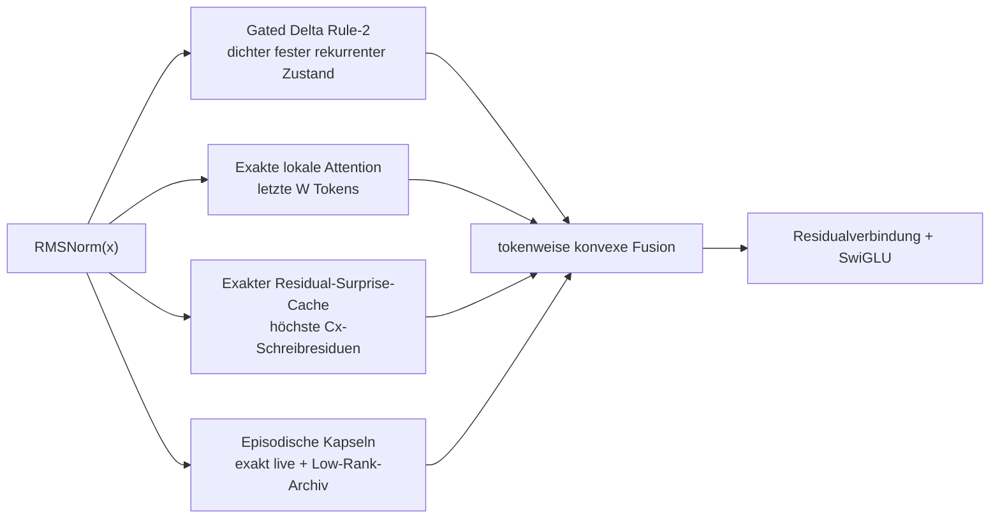

# ALUCLU

**Adaptive Layered Unified Context with Learned Updates**

<p align="center">
  <a href="README.md">English</a> ·
  <a href="README.tr.md">Türkçe</a> ·
  <a href="README.es.md">Español</a> ·
  <a href="README.ru.md">Русский</a> ·
  <a href="README.fr.md">Français</a> ·
  <strong>Deutsch</strong> ·
  <a href="README.ar.md">العربية</a>
</p>

[ALUCLU](https://github.com/kaannsaydamm/ALUCLU) ist eine von Kaan Kadir Aluçlu
entworfene Decoder-only-Forschungsarchitektur. Anstatt lange Datenströme in
einen einzigen Speichermechanismus zu zwingen, vereint sie vier unterschiedliche
physische Speicherregime in einem lernfähigen Block.

> Kontext schichten, Speicher begrenzen, Erinnerungsleistung messen.

## Architektur



- `GatedDeltaRule2` führt in jeder Schicht einen Fast-Weight-Speicher fester
  Größe mit.
- `BoundedLocalAttention` wendet echtes kausales Softmax über das
  konfigurierte jüngste Fenster an.
- `ResidualSurpriseCache` speichert Tokens, bei denen die rekurrente
  Aktualisierung ein hohes Schreibresiduum aufweist, mit fester Kapazität als
  exakte KV-Paare.
- `BoundedEpisodicMemory` hält jüngere Segmente als exakte Faktoren und ältere
  Segmente mithilfe einer dünnen QR-Zerlegung und der SVD eines kleinen Kerns
  als Kapseln mit begrenztem Rang.
- Die Ausgaben der Speicherpfade werden nach separaten RMSNorm-Schichten mit
  tokenweise gelernten, positiven Koeffizienten zusammengeführt, deren Summe
  eins beträgt.

Dieses Repository stellt ein portables, token-rekurrentes
Korrektheits-Backend bereit. Es erhebt keinen Anspruch auf einen fusionierten
GPU-Kernel, ein trainiertes großes Modell oder einen Weltrekord.

## Installation

Python 3.10 oder neuer ist erforderlich.

```powershell
python -m venv .venv
.\.venv\Scripts\python.exe -m pip install -e ".[test]"
```

Unter Linux und macOS wird im letzten Befehl `.venv/bin/python` verwendet.

## Minimales Beispiel

```python
import torch

from aluclu import AlucluLanguageModel, build_research_config

config = build_research_config(
    d_model=64,
    n_layers=4,
    local_window=64,
    segment_size=16,
    live_segments=16,
    archive_slots=4,
    archive_segments_per_slot=4,
    archive_rank=8,
    exact_cache_capacity=64,
)
model = AlucluLanguageModel(vocab_size=8192, config=config).eval()

state = None
token = torch.tensor([7])
logits, state = model.step(token, state)
```

`state` wird explizit weitergereicht und zwischen Aufrufen nicht
stillschweigend zurückgesetzt. Soll der Berechnungsgraph nicht über
Trainingsabschnitte hinweg erhalten bleiben, wird `model.detach_state(state)`
verwendet.

## Validierung

Vollständige Prüfung der portablen Version:

```powershell
python scripts\validate_release.py
```

Einzelne Prüfungen:

```powershell
python -m pytest
aluclu-train-mqar --steps 200
aluclu-train-zoology-mqar --input-seq-len 64 --num-kv-pairs 4
aluclu-benchmark --torch-threads 1
```

In einem Quellcode-Checkout stehen für dieselben Befehle außerdem die
Wrapper unter `scripts\*.py` zur Verfügung.

`benchmark_stream.py` erzeugt Zufallstokens außerhalb des gemessenen
Zeitfensters und misst Prefill und rekurrentes Decoding getrennt. Das Ergebnis
gilt ausschließlich für die verwendete Hardware, Präzision, das Modell und
das Referenz-Backend.

## Zwei MQAR-Protokolle

- `generate_mqar_batch`: ein kleines Next-Token-Diagnoseprotokoll von ALUCLU.
- `generate_zoology_mqar_batch`: die an der Query-Position ausgerichtete
  Zielsemantik des historischen Zoology-ICLR-2024-Generators. Auf diesem Pfad
  wird kein zusätzlicher Next-Token-Shift angewendet; stattdessen wird
  `zoology_mqar_loss` verwendet.

`src/aluclu/protocols/zoology_iclr24_raw.json` dokumentiert die Inkonsistenz
zwischen 4 Schichten und 2 Konfigurationen von Based im historischen Tag, ohne
sie zu verschleiern.
`src/aluclu/protocols/zoology_iclr24_repaired_v1.json` definiert die kleinste
ausführbare Korrektur unter einer separaten Protokollkennung.

## Physische Grenze

Die konfigurierte Obergrenze des episodischen Zeithorizonts lautet:

\[
T_{\mathrm{retained}}
=
\texttt{segment\_size}
\left(
1+\texttt{live\_segments}
+\texttt{archive\_slots}\,
\texttt{archive\_segments\_per\_slot}
\right).
\]

Unabhängig von diesem Altershorizont kann der Exact-Surprise-Cache die
`capacity`-Einträge mit der höchsten Priorität behalten; seine Kapazität bleibt
dennoch endlich. Mit endlicher numerischer Präzision und einem festen
physischen Zustand ist es unmöglich, unbegrenzt viele unabhängige
Schlüssel-Wert-Paare fehlerfrei abzurufen. ALUCLU verbirgt diese Grenze nicht,
sondern legt die Budgets für Window, Cache, Rank und Archive in der API offen.

## Dokumentation

- `docs/ARCHITECTURE.md`: Gleichungen, Zustands- und Rechenkosten,
  Fehlerprotokoll, Kausalität und Fehlermodi.
- `docs/RESEARCH_REPORT_TR.md`: Literatur aus dem Jahr 2026, Alternativen sowie
  Benchmark- und Ablationsplan.
- `docs/EXECUTION_PLAN_TR.md`: abgeschlossene Gates, Reihenfolge der Skalierung
  und Kernel-Implementierung sowie Abbruchkriterien.
- `docs/BRAND.md`: Benennung von ALUCLU, technische Botschaft und Zitierweise.
- `paper/ALUCLU_paper.pdf`: kompilierter 47-seitiger technischer Artikel;
  LaTeX-Quelltext und Bibliografie befinden sich unter `paper/`.
- `CHANGELOG.md`: Versionsänderungen.

## Lizenz und Zitation

Der Code wird unter der [MIT-Lizenz](LICENSE) bereitgestellt. Empfohlene
Zitierweise:

> ALUCLU Memory Architecture, Kaan Kadir Aluçlu, 2026.

Der maschinenlesbare Eintrag befindet sich in `CITATION.cff`.
