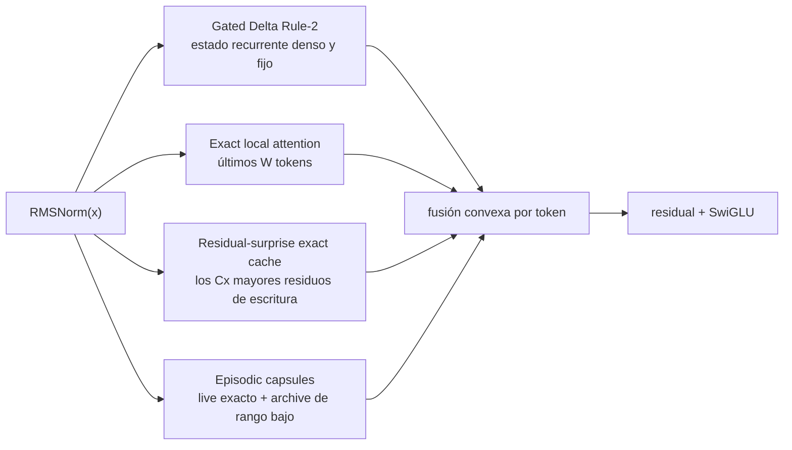

# ALUCLU

**Adaptive Layered Unified Context with Learned Updates**

<p align="center">
  <a href="README.md">English</a> ·
  <a href="README.tr.md">Türkçe</a> ·
  <strong>Español</strong> ·
  <a href="README.ru.md">Русский</a> ·
  <a href="README.fr.md">Français</a> ·
  <a href="README.de.md">Deutsch</a> ·
  <a href="README.ar.md">العربية</a>
</p>

[ALUCLU](https://github.com/kaannsaydamm/ALUCLU) es una arquitectura de
investigación de tipo decoder-only, diseñada por Kaan Kadir Aluçlu, que combina
cuatro regímenes físicos de memoria diferentes en un bloque entrenable, en
lugar de forzar los flujos largos a utilizar un único mecanismo de memoria.

> Estratifica el contexto, limita la memoria, mide el recuerdo.

## Arquitectura



- `GatedDeltaRule2` mantiene en cada capa una memoria de pesos rápidos de
  tamaño fijo.
- `BoundedLocalAttention` aplica un softmax causal real sobre la última ventana
  configurada.
- `ResidualSurpriseCache` almacena, como KV exactos y con capacidad fija, los
  tokens cuyo residuo de escritura en la actualización recurrente es elevado.
- `BoundedEpisodicMemory` conserva los segmentos recientes como factores
  exactos y los segmentos antiguos como cápsulas de rango limitado mediante
  una QR delgada y una SVD de núcleo pequeño.
- Las salidas de las rutas de memoria se combinan, después de capas RMSNorm
  independientes, mediante coeficientes aprendidos por token, positivos y cuya
  suma es uno.

Este repositorio contiene un backend portátil de referencia, orientado a la
corrección de la recurrencia token a token. No incluye kernels de GPU
fusionados, un modelo grande entrenado ni afirmación alguna de récord mundial.

## Instalación

Se requiere Python 3.10 o una versión posterior.

```powershell
python -m venv .venv
.\.venv\Scripts\python.exe -m pip install -e ".[test]"
```

En Linux y macOS se utiliza `.venv/bin/python` en el último comando.

## Uso mínimo

```python
import torch

from aluclu import AlucluLanguageModel, build_research_config

config = build_research_config(
    d_model=64,
    n_layers=4,
    local_window=64,
    segment_size=16,
    live_segments=16,
    archive_slots=4,
    archive_segments_per_slot=4,
    archive_rank=8,
    exact_cache_capacity=64,
)
model = AlucluLanguageModel(vocab_size=8192, config=config).eval()

state = None
token = torch.tensor([7])
logits, state = model.step(token, state)
```

`state` se transfiere de forma explícita y no se reinicia silenciosamente
entre llamadas. Si no se va a conservar el grafo de cálculo entre fragmentos
de entrenamiento, se utiliza `model.detach_state(state)`.

## Validación

Puerta completa de la versión portátil:

```powershell
python scripts\validate_release.py
```

Comandos individuales:

```powershell
python -m pytest
aluclu-train-mqar --steps 200
aluclu-train-zoology-mqar --input-seq-len 64 --num-kv-pairs 4
aluclu-benchmark --torch-threads 1
```

En un checkout del código fuente también están disponibles los envoltorios
`scripts\*.py` de los mismos comandos.

`benchmark_stream.py` mantiene la generación de tokens aleatorios fuera de la
ventana de temporización y mide por separado el prefill y la decodificación
recurrente. El resultado solo es válido para el hardware, la precisión, el
modelo y el backend de referencia con los que se haya ejecutado.

## Dos protocolos MQAR

- `generate_mqar_batch`: pequeño protocolo diagnóstico de next-token propio de
  ALUCLU.
- `generate_zoology_mqar_batch`: semántica de objetivos alineada con la
  posición de query del generador histórico de Zoology ICLR-2024. En esta ruta
  no se aplica ningún desplazamiento next-token adicional; se utiliza
  `zoology_mqar_loss`.

`src/aluclu/protocols/zoology_iclr24_raw.json` registra de forma explícita la
incompatibilidad histórica de Based entre 4 capas y 2 configuraciones.
`src/aluclu/protocols/zoology_iclr24_repaired_v1.json` define la reparación
mínima ejecutable con una identidad de protocolo independiente.

## Límite físico

El límite superior configurado del horizonte temporal episódico es:

\[
T_{\mathrm{retained}}
=
\texttt{segment\_size}
\left(
1+\texttt{live\_segments}
+\texttt{archive\_slots}\,
\texttt{archive\_segments\_per\_slot}
\right).
\]

La caché exacta de sorpresa puede conservar, con independencia de este
horizonte de antigüedad, los `capacity` registros de mayor prioridad; aun así,
su capacidad es finita. Con una precisión finita y un estado físico fijo, no es
posible recordar sin errores una cantidad ilimitada de pares key-value
independientes. En lugar de ocultar este límite, ALUCLU expone en su API los
presupuestos de window, cache, rank y archive.

## Documentación

- `docs/ARCHITECTURE.md`: ecuaciones, coste de estado/cómputo, registro de
  errores, causalidad y modos de fallo.
- `docs/RESEARCH_REPORT_TR.md`: literatura de 2026, alternativas y plan de
  benchmarks y ablaciones.
- `docs/EXECUTION_PLAN_TR.md`: puertas completadas, orden de escalado/fusión en
  kernels y criterios de detención.
- `docs/BRAND.md`: nomenclatura de ALUCLU, mensaje técnico y formato de cita.
- `CHANGELOG.md`: cambios de las versiones.

## Licencia y cita

El código se distribuye bajo la [licencia MIT](LICENSE). Cita recomendada:

> ALUCLU Memory Architecture, Kaan Kadir Aluçlu, 2026.

El registro legible por máquina se encuentra en `CITATION.cff`.
