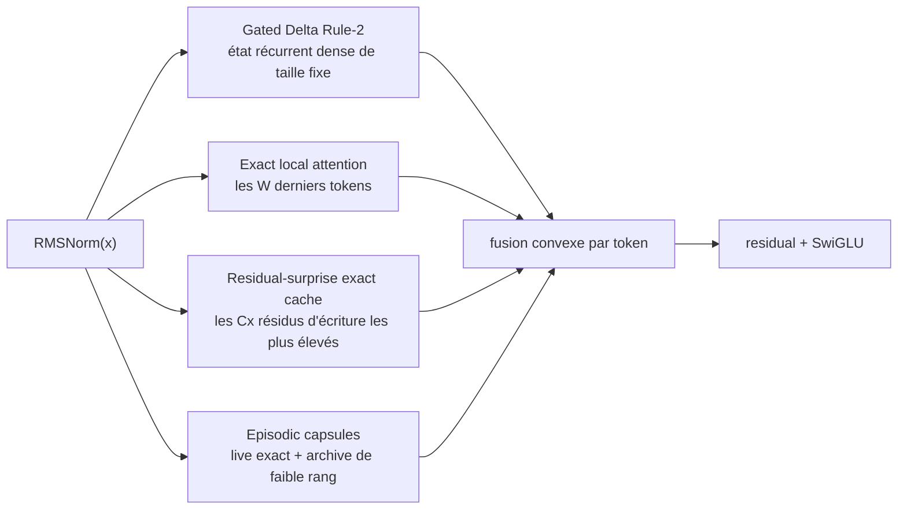

# ALUCLU

**Adaptive Layered Unified Context with Learned Updates**

<p align="center">
  <a href="README.md">English</a> ·
  <a href="README.tr.md">Türkçe</a> ·
  <a href="README.es.md">Español</a> ·
  <a href="README.ru.md">Русский</a> ·
  <strong>Français</strong> ·
  <a href="README.de.md">Deutsch</a> ·
  <a href="README.ar.md">العربية</a>
</p>

[ALUCLU](https://github.com/kaannsaydamm/ALUCLU) est une architecture de
recherche de type decoder-only conçue par Kaan Kadir Aluçlu. Au lieu de
contraindre les longs flux à utiliser un seul mécanisme de mémoire, elle réunit
quatre régimes physiques de mémoire distincts au sein d'un bloc entraînable.

> Stratifier le contexte, borner la mémoire, mesurer le rappel.

## Architecture



- `GatedDeltaRule2` maintient dans chaque couche une mémoire de poids rapides
  de taille fixe.
- `BoundedLocalAttention` applique un véritable softmax causal sur la dernière
  fenêtre configurée.
- `ResidualSurpriseCache` conserve, sous forme de KV exacts et à capacité fixe,
  les tokens dont le résidu d'écriture lors de la mise à jour récurrente est
  élevé.
- `BoundedEpisodicMemory` conserve les segments récents sous forme de facteurs
  exacts et les segments anciens sous forme de capsules à rang limité, au moyen
  d'une QR mince et d'une SVD à petit noyau.
- Après des couches RMSNorm distinctes, les sorties des chemins de mémoire sont
  combinées à l'aide de coefficients appris par token, positifs et dont la
  somme vaut un.

Ce dépôt contient un backend de référence portable axé sur l'exactitude de la
récurrence token par token. Il ne comprend ni kernel GPU fusionné, ni grand
modèle entraîné, ni revendication de record mondial.

## Installation

Python 3.10 ou une version ultérieure est requis.

```powershell
python -m venv .venv
.\.venv\Scripts\python.exe -m pip install -e ".[test]"
```

Sous Linux et macOS, `.venv/bin/python` est utilisé dans la dernière commande.

## Utilisation minimale

```python
import torch

from aluclu import AlucluLanguageModel, build_research_config

config = build_research_config(
    d_model=64,
    n_layers=4,
    local_window=64,
    segment_size=16,
    live_segments=16,
    archive_slots=4,
    archive_segments_per_slot=4,
    archive_rank=8,
    exact_cache_capacity=64,
)
model = AlucluLanguageModel(vocab_size=8192, config=config).eval()

state = None
token = torch.tensor([7])
logits, state = model.step(token, state)
```

`state` est transmis explicitement et n'est pas réinitialisé silencieusement
entre les appels. Si le graphe de calcul ne doit pas être conservé entre les
segments d'entraînement, il convient d'utiliser `model.detach_state(state)`.

## Validation

Porte de validation complète de la version portable :

```powershell
python scripts\validate_release.py
```

Commandes individuelles :

```powershell
python -m pytest
aluclu-train-mqar --steps 200
aluclu-train-zoology-mqar --input-seq-len 64 --num-kv-pairs 4
aluclu-benchmark --torch-threads 1
```

Dans un checkout du code source, les wrappers `scripts\*.py` de ces mêmes
commandes sont également disponibles.

`benchmark_stream.py` maintient la génération de tokens aléatoires en dehors de
la fenêtre de chronométrage et mesure séparément le prefill et le décodage
récurrent. Le résultat n'est valable que pour le matériel, la précision, le
modèle et le backend de référence utilisés lors de son exécution.

## Deux protocoles MQAR

- `generate_mqar_batch` : petit protocole de diagnostic next-token propre à
  ALUCLU.
- `generate_zoology_mqar_batch` : sémantique des cibles alignée sur la position
  de query du générateur historique de Zoology ICLR-2024. Aucun décalage
  next-token supplémentaire n'est appliqué sur ce chemin ;
  `zoology_mqar_loss` est utilisé.

`src/aluclu/protocols/zoology_iclr24_raw.json` consigne explicitement
l'incohérence historique de Based entre 4 couches et 2 configurations.
`src/aluclu/protocols/zoology_iclr24_repaired_v1.json` définit la réparation
exécutable minimale sous une identité de protocole distincte.

## Limite physique

La borne supérieure configurée de l'horizon temporel épisodique est :

\[
T_{\mathrm{retained}}
=
\texttt{segment\_size}
\left(
1+\texttt{live\_segments}
+\texttt{archive\_slots}\,
\texttt{archive\_segments\_per\_slot}
\right).
\]

Indépendamment de cet horizon d'ancienneté, le cache exact de surprise peut
conserver les `capacity` enregistrements ayant la priorité la plus élevée ; sa
capacité reste néanmoins finie. Avec une précision finie et un état physique
fixe, il est impossible de mémoriser sans erreur un nombre illimité de paires
key-value indépendantes. Plutôt que de masquer cette limite, ALUCLU expose dans
son API les budgets de window, cache, rank et archive.

## Documentation

- `docs/ARCHITECTURE.md` : équations, coût de l'état et du calcul, registre
  d'erreurs, causalité et modes de défaillance.
- `docs/RESEARCH_REPORT_TR.md` : littérature de 2026, solutions alternatives,
  ainsi que plan de benchmarks et d'ablations.
- `docs/EXECUTION_PLAN_TR.md` : portes franchies, ordre de mise à l'échelle et
  de fusion en kernels, ainsi que critères d'arrêt.
- `docs/BRAND.md` : dénomination d'ALUCLU, message technique et format de
  citation.
- `paper/ALUCLU_paper.pdf` : article technique compilé de 47 pages ; la source
  LaTeX et la bibliographie se trouvent dans `paper/`.
- `CHANGELOG.md` : modifications des versions.

## Licence et citation

Le code est distribué sous [licence MIT](LICENSE). Citation recommandée :

> ALUCLU Memory Architecture, Kaan Kadir Aluçlu, 2026.

L'enregistrement lisible par machine se trouve dans `CITATION.cff`.
