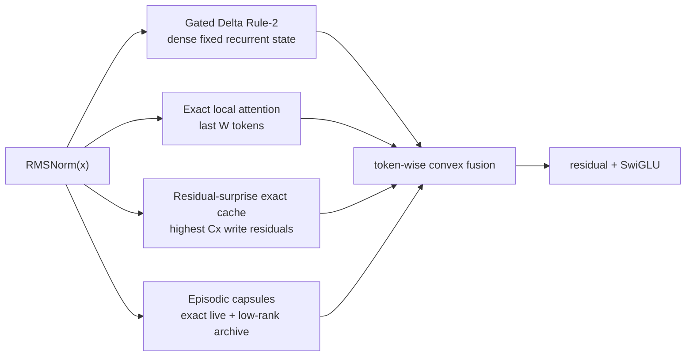

# ALUCLU

**Adaptive Layered Unified Context with Learned Updates**

<p align="center">
  <strong>English</strong> ·
  <a href="README.tr.md">Türkçe</a> ·
  <a href="README.es.md">Español</a> ·
  <a href="README.ru.md">Русский</a> ·
  <a href="README.fr.md">Français</a> ·
  <a href="README.de.md">Deutsch</a> ·
  <a href="README.ar.md">العربية</a>
</p>

[ALUCLU](https://github.com/kaannsaydamm/ALUCLU), designed by
Kaan Kadir Aluçlu, is a decoder-only research architecture that combines four
distinct physical memory regimes in a single learnable block instead of forcing
long streams into a single memory mechanism.

> Layer the context, bound the memory, measure recall.

## Architecture



- `GatedDeltaRule2` carries a fixed-size fast-weight memory in each layer.
- `BoundedLocalAttention` applies true causal softmax over a structured recent
  window.
- `ResidualSurpriseCache` stores tokens with high recurrent-update write
  residuals as exact KV entries at a fixed capacity.
- `BoundedEpisodicMemory` retains recent segments as exact factors and older
  segments as bounded-rank capsules using thin QR and small-core SVD.
- After separate RMSNorm layers, the outputs of the memory paths are combined
  with learned token-wise coefficients that are positive and sum to one.

This repository is a portable token-recurrent correctness backend. It makes no
claim of providing a fused GPU kernel, a trained large model, or a world record.

## Installation

Python 3.10 or later is required.

```powershell
python -m venv .venv
.\.venv\Scripts\python.exe -m pip install -e ".[test]"
```

On Linux and macOS, use `.venv/bin/python` in the final command.

## Minimal usage

```python
import torch

from aluclu import AlucluLanguageModel, build_research_config

config = build_research_config(
    d_model=64,
    n_layers=4,
    local_window=64,
    segment_size=16,
    live_segments=16,
    archive_slots=4,
    archive_segments_per_slot=4,
    archive_rank=8,
    exact_cache_capacity=64,
)
model = AlucluLanguageModel(vocab_size=8192, config=config).eval()

state = None
token = torch.tensor([7])
logits, state = model.step(token, state)
```

`state` is carried explicitly; it is not silently reset between calls. Use
`model.detach_state(state)` if the computation graph should not be retained
across training chunks.

## Validation

The complete portable release gate:

```powershell
python scripts\validate_release.py
```

Individually:

```powershell
python -m pytest
aluclu-train-mqar --steps 200
aluclu-train-zoology-mqar --input-seq-len 64 --num-kv-pairs 4
aluclu-benchmark --torch-threads 1
```

The `scripts\*.py` wrappers for the same commands are also available in a
source checkout.

`benchmark_stream.py` keeps random token generation outside the timing window
and measures prefill and recurrent decode separately. A result is valid only
for the hardware, precision, model, and reference backend on which it was run.

## Two MQAR protocols

- `generate_mqar_batch`: ALUCLU's small diagnostic next-token protocol.
- `generate_zoology_mqar_batch`: the target semantics of the historical
  Zoology ICLR-2024 generator, aligned at the query position. This path applies
  no additional next-token shift; it uses `zoology_mqar_loss`.

`src/aluclu/protocols/zoology_iclr24_raw.json` transparently records the
Based 4-layer/2-config mismatch in the historical tag.
`src/aluclu/protocols/zoology_iclr24_repaired_v1.json` defines the smallest
runnable repair under a separate protocol identity.

## Physical limit

The configured upper bound of the episodic time horizon is:

\[
T_{\mathrm{retained}}
=
\texttt{segment\_size}
\left(
1+\texttt{live\_segments}
+\texttt{archive\_slots}\,
\texttt{archive\_segments\_per\_slot}
\right).
\]

Independently of this age horizon, the exact surprise cache can retain the
highest-priority `capacity` records; its capacity is still finite. With finite
precision and a fixed physical state, it is impossible to recall an unbounded
number of independent key-value pairs without error. Rather than hide this
limit, ALUCLU exposes the window, cache, rank, and archive budgets in the API.

## Documentation

- `docs/ARCHITECTURE.md`: equations, state/compute cost, error ledger,
  causality, and failure modes.
- `docs/RESEARCH_REPORT_TR.md`: 2026 literature, alternatives, and the
  benchmark and ablation plan.
- `docs/EXECUTION_PLAN_TR.md`: completed gates, scaling/kernelization order,
  and stopping criteria.
- `docs/BRAND.md`: ALUCLU naming, technical message, and citation format.
- `CHANGELOG.md`: release changes.

## License and citation

The terms governing use of the code are specified in the [LICENSE](LICENSE)
file in this repository. Suggested citation:

> ALUCLU Memory Architecture, Kaan Kadir Aluçlu, 2026.

The machine-readable record is in `CITATION.cff`.
