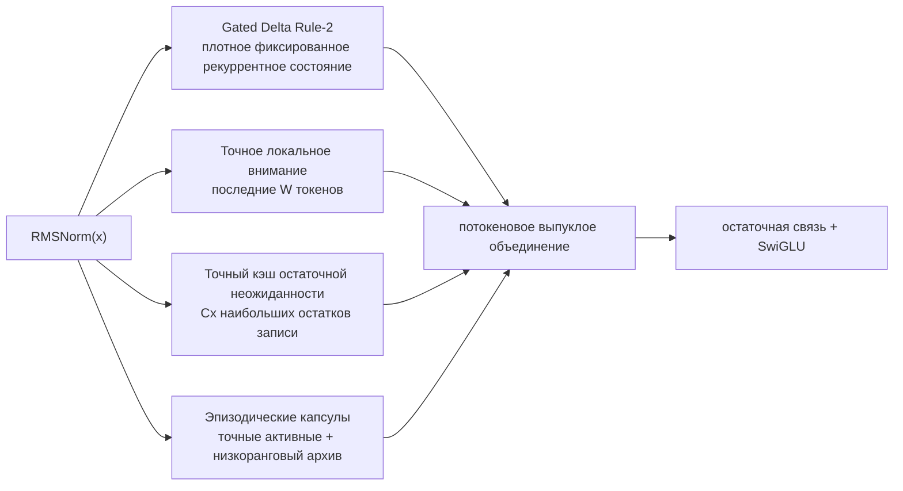

# ALUCLU

**Adaptive Layered Unified Context with Learned Updates**

<p align="center">
  <a href="README.md">English</a> ·
  <a href="README.tr.md">Türkçe</a> ·
  <a href="README.es.md">Español</a> ·
  <strong>Русский</strong> ·
  <a href="README.fr.md">Français</a> ·
  <a href="README.de.md">Deutsch</a> ·
  <a href="README.ar.md">العربية</a>
</p>

[ALUCLU](https://github.com/kaannsaydamm/ALUCLU) — разработанная Kaan Kadir
Aluçlu исследовательская архитектура типа decoder-only, которая объединяет в одном
обучаемом блоке четыре различных режима физической памяти, вместо того чтобы
сводить обработку длинных потоков к единственному механизму памяти.

> Структурируй контекст по слоям, ограничивай память, измеряй качество воспроизведения.

## Архитектура



- `GatedDeltaRule2` поддерживает в каждом слое память быстрых весов
  фиксированного размера.
- `BoundedLocalAttention` применяет полное каузальное softmax-внимание в
  пределах настроенного окна последних токенов.
- `ResidualSurpriseCache` сохраняет в виде точных KV-пар с фиксированной
  ёмкостью те токены, для которых рекуррентное обновление имеет большой остаток
  записи.
- `BoundedEpisodicMemory` хранит недавние сегменты в виде точных факторов, а
  более старые — в виде капсул ограниченного ранга, полученных с помощью экономичного
  QR-разложения и SVD малого ядра.
- Выходы путей памяти после отдельных слоёв RMSNorm объединяются с помощью
  положительных, обучаемых для каждого токена коэффициентов, сумма которых
  равна единице.

Этот репозиторий содержит переносимую token-recurrent эталонную реализацию для
проверки корректности. Он не заявляет о наличии объединённого GPU-ядра, обученной большой
модели или мирового рекорда.

## Установка

Требуется Python 3.10 или новее.

```powershell
python -m venv .venv
.\.venv\Scripts\python.exe -m pip install -e ".[test]"
```

В Linux и macOS в последней команде используется `.venv/bin/python`.

## Минимальный пример

```python
import torch

from aluclu import AlucluLanguageModel, build_research_config

config = build_research_config(
    d_model=64,
    n_layers=4,
    local_window=64,
    segment_size=16,
    live_segments=16,
    archive_slots=4,
    archive_segments_per_slot=4,
    archive_rank=8,
    exact_cache_capacity=64,
)
model = AlucluLanguageModel(vocab_size=8192, config=config).eval()

state = None
token = torch.tensor([7])
logits, state = model.step(token, state)
```

`state` передаётся явно и не сбрасывается без уведомления между вызовами. Если
граф вычислений не требуется сохранять между фрагментами обучения, следует
использовать `model.detach_state(state)`.

## Проверка

Полная проверка переносимой версии:

```powershell
python scripts\validate_release.py
```

Отдельные проверки:

```powershell
python -m pytest
aluclu-train-mqar --steps 200
aluclu-train-zoology-mqar --input-seq-len 64 --num-kv-pairs 4
aluclu-benchmark --torch-threads 1
```

При работе с checkout исходного кода для тех же команд также доступны
обёртки `scripts\*.py`.

`benchmark_stream.py` генерирует случайные токены вне измеряемого временного
окна и измеряет prefill отдельно от рекуррентного декодирования. Результат
действителен только для оборудования, числовой точности, модели и эталонной
реализации, на которых он был получен.

## Два протокола MQAR

- `generate_mqar_batch`: небольшой диагностический next-token-протокол ALUCLU.
- `generate_zoology_mqar_batch`: целевая семантика исторического генератора
  Zoology ICLR-2024, выровненная по позиции запроса. На этом пути дополнительный
  next-token shift не применяется; используется `zoology_mqar_loss`.

`src/aluclu/protocols/zoology_iclr24_raw.json` без сокрытия фиксирует
несоответствие Based «4 слоя/2 конфигурации» в историческом теге.
`src/aluclu/protocols/zoology_iclr24_repaired_v1.json` определяет минимальное
исполняемое исправление под отдельным идентификатором протокола.

## Физический предел

Настраиваемая верхняя граница временного горизонта эпизодической памяти:

\[
T_{\mathrm{retained}}
=
\texttt{segment\_size}
\left(
1+\texttt{live\_segments}
+\texttt{archive\_slots}\,
\texttt{archive\_segments\_per\_slot}
\right).
\]

Независимо от этого возрастного горизонта точный кэш, отбираемый по остаточной
неожиданности, может хранить `capacity` записей с наивысшим приоритетом, но его
ёмкость всё равно конечна. При конечной числовой точности и фиксированном
физическом состоянии невозможно хранить и безошибочно извлекать неограниченное
число независимых пар ключ–значение. ALUCLU не скрывает это ограничение, а явно
представляет в API бюджеты окна, кэша, ранга и архива.

## Документация

- `docs/ARCHITECTURE.md`: уравнения, стоимость состояния и вычислений, журнал
  ошибок, каузальность и режимы отказа.
- `docs/RESEARCH_REPORT_TR.md`: литература за 2026 год, альтернативы, план
  бенчмарков и абляций.
- `docs/EXECUTION_PLAN_TR.md`: пройденные этапы проверки, порядок
  масштабирования и разработки вычислительных ядер, а также критерии остановки.
- `docs/BRAND.md`: наименование ALUCLU, техническое сообщение и формат
  цитирования.
- `paper/ALUCLU_paper.pdf`: скомпилированная 47-страничная техническая статья;
  исходный LaTeX и библиография находятся в `paper/`.
- `CHANGELOG.md`: изменения версий.

## Лицензия и цитирование

Код распространяется по [лицензии MIT](LICENSE). Рекомендуемая форма
цитирования:

> ALUCLU Memory Architecture, Kaan Kadir Aluçlu, 2026.

Машиночитаемая запись находится в `CITATION.cff`.
