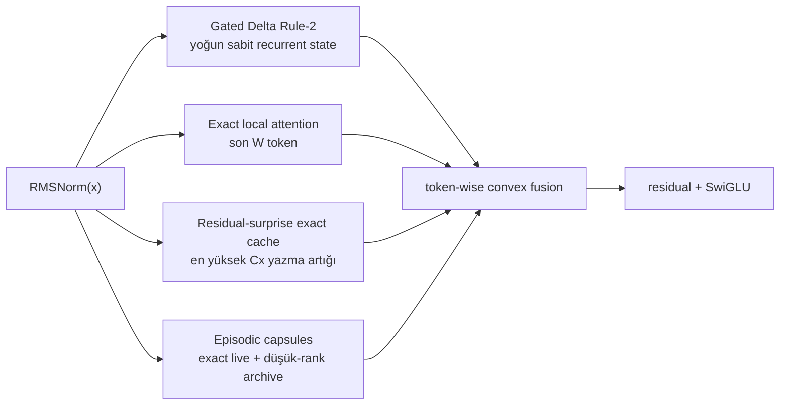

# ALUCLU

**Adaptive Layered Unified Context with Learned Updates**

<p align="center">
  <a href="README.md">English</a> ·
  <strong>Türkçe</strong> ·
  <a href="README.es.md">Español</a> ·
  <a href="README.ru.md">Русский</a> ·
  <a href="README.fr.md">Français</a> ·
  <a href="README.de.md">Deutsch</a> ·
  <a href="README.ar.md">العربية</a>
</p>

[ALUCLU](https://github.com/kaannsaydamm/ALUCLU), Kaan Kadir Aluçlu
tarafından tasarlanan; uzun akışları tek bir bellek mekanizmasına zorlamak
yerine dört farklı fiziksel bellek rejimini öğrenilebilir bir blokta birleştiren
decoder-only araştırma mimarisidir.

> Bağlamı katmanla, belleği sınırla, hatırlamayı ölç.

## Mimari



- `GatedDeltaRule2`, her katmanda sabit boyutlu hızlı-ağırlık belleği taşır.
- `BoundedLocalAttention`, yapılandırılmış son pencere üzerinde gerçek causal
  softmax uygular.
- `ResidualSurpriseCache`, recurrent güncellemenin yüksek yazma artıklı
  tokenlarını sabit kapasitede exact KV olarak saklar.
- `BoundedEpisodicMemory`, yakın segmentleri exact faktörler; eski segmentleri
  ince QR ve küçük-çekirdek SVD ile sınırlı-rank kapsüller olarak tutar.
- Bellek yollarının çıktıları ayrı RMSNorm katmanlarından sonra token bazında
  öğrenilen, pozitif ve toplamı bir olan katsayılarla birleştirilir.

Bu depo taşınabilir token-recurrent doğruluk backend'idir. Fused GPU kernel,
eğitilmiş büyük model veya dünya rekoru iddiası içermez.

## Kurulum

Python 3.10 veya üzeri gerekir.

```powershell
python -m venv .venv
.\.venv\Scripts\python.exe -m pip install -e ".[test]"
```

Linux ve macOS üzerinde son komutta `.venv/bin/python` kullanılır.

## En küçük kullanım

```python
import torch

from aluclu import AlucluLanguageModel, build_research_config

config = build_research_config(
    d_model=64,
    n_layers=4,
    local_window=64,
    segment_size=16,
    live_segments=16,
    archive_slots=4,
    archive_segments_per_slot=4,
    archive_rank=8,
    exact_cache_capacity=64,
)
model = AlucluLanguageModel(vocab_size=8192, config=config).eval()

state = None
token = torch.tensor([7])
logits, state = model.step(token, state)
```

`state` açıkça taşınır; çağrılar arasında sessizce sıfırlanmaz. Eğitim
parçaları arasında hesaplama grafiği tutulmayacaksa
`model.detach_state(state)` kullanılır.

## Doğrulama

Tüm taşınabilir sürüm kapısı:

```powershell
python scripts\validate_release.py
```

Tek tek:

```powershell
python -m pytest
aluclu-train-mqar --steps 200
aluclu-train-zoology-mqar --input-seq-len 64 --num-kv-pairs 4
aluclu-benchmark --torch-threads 1
```

Kaynak checkout'unda aynı komutların `scripts\*.py` sarmalayıcıları da vardır.

`benchmark_stream.py`, rastgele token üretimini zamanlama penceresinin dışında
tutar ve prefill ile recurrent decode'u ayrı ölçer. Sonuç yalnız çalıştırıldığı
donanım, precision, model ve referans backend için geçerlidir.

## İki MQAR protokolü

- `generate_mqar_batch`: ALUCLU'ya ait küçük tanısal next-token protokolü.
- `generate_zoology_mqar_batch`: tarihsel Zoology ICLR-2024 üreticisinin
  query-konumunda hizalı hedef semantiği. Bu yolda ek next-token shift
  uygulanmaz; `zoology_mqar_loss` kullanılır.

`src/aluclu/protocols/zoology_iclr24_raw.json`, tarihsel etiketteki Based
4-katman/2-config uyuşmazlığını saklamadan kaydeder.
`src/aluclu/protocols/zoology_iclr24_repaired_v1.json`, en küçük
çalıştırılabilir onarımı ayrı bir protokol kimliğiyle tanımlar.

## Fiziksel sınır

Episodic zaman ufkunun yapılandırılmış üst sınırı:

\[
T_{\mathrm{retained}}
=
\texttt{segment\_size}
\left(
1+\texttt{live\_segments}
+\texttt{archive\_slots}\,
\texttt{archive\_segments\_per\_slot}
\right).
\]

Exact surprise cache bu yaş ufkundan bağımsız olarak en yüksek öncelikli
`capacity` kaydı tutabilir; yine de kapasite sonludur. Sonlu precision ve sabit
fiziksel durumla sınırsız sayıda bağımsız key-value çiftini hatasız hatırlamak
mümkün değildir. ALUCLU bu sınırı gizlemek yerine window, cache, rank ve archive
bütçelerini API'de görünür kılar.

## Belgeler

- `docs/ARCHITECTURE.md`: denklemler, state/hesap maliyeti, hata defteri,
  nedensellik ve başarısızlık kipleri.
- `docs/RESEARCH_REPORT_TR.md`: 2026 literatürü, alternatifler, benchmark ve
  ablation planı.
- `docs/EXECUTION_PLAN_TR.md`: tamamlanan kapılar, ölçek/kernelleşme sırası ve
  durdurma ölçütleri.
- `docs/BRAND.md`: ALUCLU adlandırması, teknik mesaj ve atıf biçimi.
- `CHANGELOG.md`: sürüm değişiklikleri.

## Lisans ve atıf

Kodun kullanım koşulları bu depodaki [LICENSE](LICENSE) dosyasında belirtilir.
Önerilen atıf:

> ALUCLU Memory Architecture, Kaan Kadir Aluçlu, 2026.

Makine tarafından okunabilir kayıt `CITATION.cff` içindedir.
