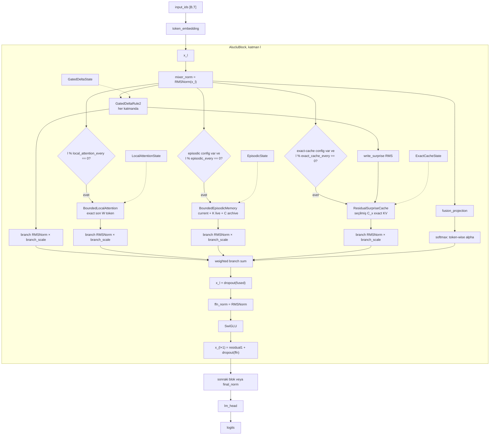

# ALUCLU: Adaptive Layered Unified Context with Learned Updates

## Belgenin amacı ve iddia sınırı

ALUCLU, her katmanda sabit boyutlu bir `GatedDeltaRule2` recurrence kullanan;
seçilmiş katmanlarda buna sabit pencereli exact local attention, sınırlı
episodic memory ve sabit kapasiteli residual-surprise exact KV cache ekleyen
decoder-only bir araştırma mimarisidir. Katman çıktıları token bazında
öğrenilen katsayılarla birleştirilir ve SwiGLU ile işlenir.

Bu belge mevcut Python referans implementasyonunu tarif eder. Denklem ve
karmaşıklık ifadeleri aşağıdaki gerçek sınıflara ve state alanlarına dayanır:

- `AlucluLanguageModel`
- `AlucluBlock`
- `GatedDeltaRule2`
- `BoundedLocalAttention`
- `BoundedEpisodicMemory`
- `ResidualSurpriseCache`
- `MassConservingRouter`
- `MemorySlot`
- `truncate_factors_with_error`

Bu implementasyon:

- bounded recurrent inference state sağlar;
- token-token çalışan taşınabilir doğruluk backend'idir;
- fused GPU kernel değildir;
- sınırsız geçmişte kayıpsız hatırlama sağlamaz;
- sabit state'in eğitim aktivasyon belleğini sabit yaptığı anlamına gelmez;
- herhangi bir kalite, throughput, dünya rekoru veya SOTA sonucu iddia etmez.

Kodda ASCII proje adı `aluclu` olarak kullanılacaktır. Bu belge hazırlanırken
kaynak modüller çalışma ağacında `src/aluclu` altında bulunuyordu; aşağıdaki
sınıf ve alan adları incelenen implementasyonun gerçek adlarıdır.

## Sembol ve yapılandırma eşlemesi

| Sembol | Kod karşılığı | Anlam |
|---|---|---|
| \(B\) | `batch_size` | Batch boyutu |
| \(T\) | `x.shape[1]` veya `input_ids.shape[1]` | Bu çağrıda işlenen token sayısı |
| \(d\) | `d_model` | Model, episodic key ve episodic value genişliği |
| \(L\) | `n_layers` | ALUCLU blok sayısı |
| \(H\) | `n_heads` | Gated Delta head sayısı |
| \(d_k\) | `head_key_dim` | Bir Gated Delta head'inin key genişliği |
| \(d_v\) | `head_value_dim` | Bir Gated Delta head'inin value genişliği |
| \(W\) | `local_window` | Local attention KV penceresi |
| \(C_x\) | `ExactCacheConfig.capacity` | Residual-surprise exact KV kapasitesi |
| \(S\) | `segment_size` | Episodic segment başına token sayısı |
| \(K\) | `live_segments` | Exact tamamlanmış segment sayısı |
| \(C\) | `archive_slots` | Sıkıştırılmış temporal kapsül sayısı |
| \(A\) | `archive_segments_per_slot` | Bir archive kapsülündeki azami segment sayısı |
| \(r\) | `archive_rank` | Archive numerator azami rank'ı |
| \(d_r\) | `router_dimension` | L2-normalize route vektörü boyutu |
| \(p\) | `router_degree` | TensorSketch polynomial derecesi |
| \(m\) | `sketch_dim` | Bir TensorSketch genişliği |
| \(J\) | `n_sketches` | Bağımsız sketch sayısı |
| \(\kappa_g\) | `GatedDeltaConfig.conv_kernel` | Gated Delta causal stem çekirdeği |
| \(\kappa_e\) | `EpisodicMemoryConfig.conv_kernel` | Episodic causal stem çekirdeği |
| \(b_x\) | `x.element_size()` | Model-state dtype başına byte |

`AlucluConfig.__post_init__`, `GatedDeltaConfig.__post_init__`,
`ExactCacheConfig.__post_init__` ve `EpisodicMemoryConfig.__post_init__`
pozitif boyutları, ilgili head bölünebilirliğini, feature sınırlarını ve temel
rank sınırını doğrular. `archive_rank + segment_size` değerinin \(d\)'den küçük
olması zorunlu tutulmamıştır; bunun small-core SVD üzerindeki etkisi aşağıda
ayrıca açıklanır.

## Katman yerleşimi

Katmanlar 1-tabanlı düşünülürse:

- her katmanda `GatedDeltaRule2` vardır;
- \(l \bmod \texttt{local_attention_every}=0\) ise
  `BoundedLocalAttention` vardır;
- episodic config verilmiş ve
  \(l \bmod \texttt{episodic_every}=0\) ise
  `BoundedEpisodicMemory` vardır.
- exact-cache config verilmiş ve
  \(l \bmod \texttt{exact_cache_every}=0\) ise
  `ResidualSurpriseCache` vardır.

Dolayısıyla local branch sayısı

\[
N_{\mathrm{local}}
=
\left\lfloor
\frac{L}{\texttt{local\_attention\_every}}
\right\rfloor
\]

ve episodic config mevcutsa episodic branch sayısı

\[
N_{\mathrm{epi}}
=
\left\lfloor
\frac{L}{\texttt{episodic\_every}}
\right\rfloor
\]

olur. Episodic config yoksa \(N_{\mathrm{epi}}=0\)'dır.

Exact-cache config mevcutsa exact-cache branch sayısı:

\[
N_{\mathrm{exact}}
=
\left\lfloor
\frac{L}{\texttt{exact\_cache\_every}}
\right\rfloor
\]

olur; config yoksa \(N_{\mathrm{exact}}=0\)'dır.

## Gerçek veri akışı



Branch output'ları birbirlerini sırayla tüketmez. Hepsi aynı
`mixer_norm(x)` tensörünü okur ve kendi state'ini günceller. Exact-cache
branch'i ayrıca Gated Delta'nın output vektörünü değil, aynı adımda hesaplanan
scalar `write_surprise` seçim sinyalini kullanır. Fusion bütün branch
output'larından sonra yapılır.

## Write-then-read nedenselliği

Memory yolları mevcut token'ın state güncelleme veya seçim kararını
readout'tan önce uygular. Bu nedenle kabul edilen/güncellenen token için
implementasyon \(j\le t\) inclusive causal semantiğe sahiptir.

### Gated Delta yolu

`GatedDeltaRule2.forward` token \(t\) için önce decay/erase/write recurrence'ını
uygular, ardından güncellenmiş `fast_weight` ile query readout'u hesaplar.

### Local attention yolu

`BoundedLocalAttention.forward` önce \(k_t,v_t\)'yi rolling cache'e ekler,
cache'i son \(W\) token'a keser, sonra \(q_t\) ile softmax attention uygular.

### Episodic yol

`BoundedEpisodicMemory.forward` sırası:

1. `_token_slot` ile token state'i oluşturulur.
2. `_write_token` ile current/live/archive geçişleri tamamlanır.
3. Güncel `archive + live + current` slot listesi oluşturulur.
4. `aggregate` ile aynı token'ın readout'u hesaplanır.

Segment sınırındaki token da önce tamamlanan segmente girer; gerekiyorsa en
eski live segment aynı adımda archive'a aktarılır; readout bundan sonra yapılır.
Hiçbir token kaybolmaz veya iki slotta birden tutulmaz.

### Residual-surprise exact-cache yolu

`ResidualSurpriseCache.forward` önce current token'ın priority değerini cache
minimumuyla karşılaştırır. Kapasite varsa token yazılır; cache doluysa yalnız
priority mevcut minimumdan kesin olarak büyükse minimum kayıt değiştirilir.
Read bundan sonra güncel valid cache üzerinde yapılır. Reddedilen current token
cache read'ine key/value olarak katılmaz; buna rağmen read geçmişe bağlı ve
causal kalır.

`AlucluLanguageModel` next-token loss'u ayrıca
`logits[:, :-1]` ile `labels[:, 1:]` arasında hesaplar. Inclusive memory okuması
bu kaydırmayla uyumludur.

Gelecek token'ın geçmiş output'u değiştirmediği episodic, local ve exact-cache
testlerinde bit-eşit olarak kontrol edilir. Chunk/step eşitliği eğitimde
dropout RNG tüketimine bağlıdır; test edilen scan/step garantisi `.eval()`
modundadır.

## Streaming causal stem

Hem Gated Delta hem episodic branch ayrı bir
`StreamingDepthwiseConv1d` taşır.

Bir branch için:

\[
\texttt{context}
=
[\texttt{conv\_history};x_{1:T}],
\]

\[
\texttt{hidden}
=
\operatorname{DepthwiseConv1d}(\texttt{context}),
\]

\[
\texttt{next\_history}
=
\texttt{context}_{-(\kappa-1):}.
\]

Persistent mantıksal history boyutu \(B(\kappa-1)d\)'dir. Kernel başlangıçta
identity olacak şekilde ayarlanır: tüm ağırlıklar sıfır, son causal tap bir ve
bias sıfırdır.

## Gated Delta Rule-2 recurrence

Bu bölüm `GatedDeltaRule2.forward` içindeki gerçek token recurrence'ını
tanımlar.

Her head için:

\[
q_t,k_t\in\mathbb R^{d_k},
\qquad
v_t,w_t\in\mathbb R^{d_v},
\qquad
e_t,\gamma_t\in\mathbb R^{d_k}.
\]

Query ve key:

\[
q_t
=
\operatorname{L2Normalize}(W_qh_t,\epsilon),
\]

\[
k_t
=
\operatorname{L2Normalize}(W_kh_t,\epsilon).
\]

Value, erase ve write yolları:

\[
v_t=W_vh_t,
\qquad
e_t=\sigma(W_eh_t+b_e),
\qquad
w_t=\sigma(W_wh_t+b_w).
\]

Kodda `decay_log_scale` üstel alınır:

\[
a=\exp(\texttt{decay\_log\_scale})>0.
\]

Token-dependent decay:

\[
\log\gamma_t
=
-a\odot
\operatorname{softplus}
\left(
W_\gamma h_t+\texttt{decay\_offset}
\right),
\]

\[
\gamma_t
=
\max
\left(
\exp(\log\gamma_t),
\texttt{decay\_min}
\right).
\]

`fast_weight` state'ini

\[
F_{t-1}\in\mathbb R^{d_k\times d_v}
\]

olarak gösterelim. Kodun recurrence'ı:

\[
\bar F_t
=
\operatorname{diag}(\gamma_t)F_{t-1},
\]

\[
a_t=e_t\odot k_t,
\]

\[
\widehat v_t=\bar F_t^\top a_t,
\]

\[
v_t^{\mathrm{target}}=w_t\odot v_t,
\]

\[
\Delta v_t
=
v_t^{\mathrm{target}}-\widehat v_t.
\]

Exact-cache seçim sinyali bu write artığının head ve value eksenleri üzerindeki
RMS değeridir:

\[
\xi_t
=
\sqrt{
\operatorname{mean}_{h,v}
\left[
(\Delta v_{t,h,v})^2
\right]
}.
\]

Kod bunu `write_surprise` adıyla döndürür. Bu bir Öklid normu değil, eleman
sayısına normalize edilmiş RMS'tir.

\[
F_t
=
\bar F_t
+
k_t
(\Delta v_t)^\top.
\]

Readout güncellenmiş state'ten gelir:

\[
o_t=F_t^\top q_t.
\]

Son olarak:

\[
\widetilde o_t
=
o_t
\odot
\operatorname{SiLU}(W_oh_t),
\]

ve head'ler birleştirilip `output_projection` uygulanır.

`fast_weight`, decay hesabı ve token recurrence mixed precision altında fp32
çalışır. `conv_history` model dtype'ındadır. Bu implementasyon parallel/chunk
Gated Delta kernel'i değil, token-wise correctness oracle ve CPU fallback'tir.

## Exact bounded local attention

Bir local head genişliği

\[
d_h=d/\texttt{local\_heads}
\]

olur. Cache her token'da:

\[
K_t=[K_{t-1};k_t]_{-W:},
\qquad
V_t=[V_{t-1};v_t]_{-W:}
\]

şeklinde kesilir.

Head \(h\), cache pozisyonu \(j\) için score:

\[
s_{t,j,h}
=
\frac{q_{t,h}^\top k_{j,h}}{\sqrt{d_h}}
-
\operatorname{softplus}(\texttt{slope\_raw}_h)
\,(t-j).
\]

Softmax fp32'de hesaplanır ve model dtype'ına geri çevrilir:

\[
\alpha_{t,:,h}
=
\operatorname{softmax}(s_{t,:,h}).
\]

Eğitim modunda `dropout` attention ağırlıklarına uygulanır. Bu yol:

- yalnızca son \(W\) token'ı görebilir;
- bu pencere içinde gerçek softmax attention hesaplar;
- \(W\)'den eski token'lar için hiçbir erişim sağlamaz;
- saturated state'te key ve value için toplam \(2BdW\) eleman tutar.

## Residual-surprise exact KV cache

`ResidualSurpriseCache`, Gated Delta state'ine iyi yazılamayan token'ları
ayrı, sabit kapasiteli ve sıkıştırılmamış bir KV setinde tutar. “Exact” sözcüğü
yalnız cache'e kabul edilen token'ların projected key/value tensörlerinin
rank-truncation veya özetleme olmadan saklandığını ifade eder. Bu yol bütün
token'ları, ham hidden state'i veya token kimliğini saklamaz.

Config:

- `d_model = d`
- `n_heads = H_x`
- `capacity = C_x`
- head genişliği \(d_x=d/H_x\)

State başlangıçta tam şekliyle ayrılır:

```text
ExactCacheState
├── key       [B, H_x, C_x, d_x]   # model dtype
├── value     [B, H_x, C_x, d_x]   # model dtype
├── priority  [B, C_x]             # normal yolda fp32, float64 test yolunda fp64
├── valid     [B, C_x]             # bool, başlangıç false
└── tokens_seen
```

### Ayrı KV projeksiyonu

Cache kendi projection'larını kullanır:

\[
q_t^x=W_q^xh_t,
\qquad
k_t^x=W_k^xh_t,
\qquad
v_t^x=W_v^xh_t.
\]

Seçim skoru başka bir projection'dan değil, aynı bloktaki
`GatedDeltaRule2` tarafından hesaplanan:

\[
\xi_t
=
\sqrt{
\operatorname{mean}_{h,v}
\left[
(\Delta v_{t,h,v})^2
\right]
}
\]

write-residual RMS değerinden gelir. Bütün exact-cache head'leri için token
başına tek scalar priority kullanılır.

### Hard top-\(C_x\) insertion

Batch örneği bazında boş cache pozisyonları:

\[
\mathcal E_t=\{j:\neg\texttt{valid}_{t-1,j}\}.
\]

Boş pozisyon varsa kod ilk boş indeksi seçer. Cache doluysa:

\[
j_{\min}
=
\arg\min_j \texttt{priority}_{t-1,j}.
\]

Incoming priority seçimden önce:

\[
\widehat\xi_t
=
\operatorname{stopgrad}(\xi_t)
\]

ile ayrılır ve fp32'ye çevrilir.

Write kararı:

\[
\operatorname{write}_t
=
\left(
\mathcal E_t\ne\varnothing
\right)
\lor
\left(
\widehat\xi_t
>
\texttt{priority}_{t-1,j_{\min}}
\right).
\]

Eşit priority mevcut kaydı değiştirmez. Write doğruysa bütün head'lerin
\(k_t^x,v_t^x\) değeri seçilen aynı cache pozisyonuna yazılır. Write yanlışsa
KV, priority ve valid tensörleri semantik olarak değişmez.

Priority'ler ayrık olduğunda cache, görülen token'ların en yüksek
\(\min(C_x,t)\) write-residual RMS değerlerini tutar. Eşitlikte strict `>`
nedeniyle daha eski eşit-priority kayıt korunur. Seçim recency, token yaşı veya
local-attention score'u kullanmaz.

### Write-then-read exact softmax

Insertion kararından sonra, valid cache için:

\[
s_{t,h,j}
=
\frac{
{q_{t,h}^x}^{\!\top}k_{j,h}^x
}{
\sqrt{d_x}
}.
\]

Invalid pozisyonlar floating dtype'ın en küçük değeriyle maskelenir. En az
ilk token boş cache'e yazıldığı için read sırasında her batch örneğinde en az
bir valid kayıt vardır.

\[
\alpha_{t,h,:}
=
\operatorname{softmax}
\left(
s_{t,h,:}
\right),
\]

\[
o_{t,h}^x
=
\sum_{j:\mathrm{valid}_j}
\alpha_{t,h,j}v_{j,h}^x.
\]

Softmax fp32'de hesaplanır, query dtype'ına çevrilir ve eğitim modunda
`ExactCacheConfig.dropout` uygulanır. Head'ler birleştirilip
`output_projection` ile \(d\)'ye döndürülür.

Cache'e kabul edilen current token aynı adımın read'ine katılır. Reddedilen
token query üretir, fakat kendi key/value'su cache read'inde bulunmaz.

### Hard-selection gradyan sınırı

`priority.detach().float()` ve integer/one-hot index seçimi nedeniyle:

- exact-cache loss'undan \(\xi_t\)'ye gradyan gitmez;
- exact-cache branch Gated Delta write residual'ını doğrudan öğrenemez;
- priority sıralaması ve replacement kararı türevlenebilir değildir;
- kabul edilen KV'ler, cache readout'u üzerinden projection gradyanı alır;
- reddedilen token'ın query yolu gradyan alabilir, fakat o token'ın cache
  key/value yazma yolu katkı üretmez;
- seçim sınırında küçük bir priority değişimi ayrık cache değişimine yol
  açabilir.

Gated Delta parametreleri kendi branch loss'u ve ortak fusion üzerinden
öğrenmeye devam eder. Ancak surprise score ile exact-cache faydası arasında
end-to-end differentiable credit assignment yoktur.

### Neden local lane ile birlikte kullanılır?

Residual-surprise cache global top-\(C_x\) priority setidir. Yaş decay'i veya
recency kotası yoktur; erken yüksek-priority outlier'lar cache'i uzun süre
tutabilir. Local lane son \(W\) token'ı priority'den bağımsız saklayarak yakın
geçmişi korur. Bu tamamlayıcılık mimari niyettir; kalite garantisi değildir.

### State ve işlem maliyeti

Logical eleman sayısı:

\[
F_{\mathrm{exact}}
=
2C_xd+2C_x.
\]

Son \(2C_x\), `priority` ve `valid` eleman sayısıdır; dtype'ları farklıdır.
Byte karşılığı:

\[
\mathrm{bytes}_{\mathrm{exact},B=1}
=
2b_xC_xd
+
4C_x
+
C_x.
\]

Burada fp32 priority 4 byte, bool valid 1 byte kabul edilmiştir.

Her token'da:

- minimum/boş pozisyon seçimi \(O(C_x)\);
- `torch.where` tabanlı full cache update \(O(C_xd)\);
- attention score ve value read \(O(C_xd)\);
- QKV/output projection maliyeti ayrıca dense projection maliyetidir.

Persistent state ve cache read/write maliyeti \(T\)'den bağımsız,
\(O(C_xd)\)'dir. Referans kod hard selection reddetse bile full-shape
`torch.where` tensörlerini üretir; teorik sabit state bunun allocation-free
kernel olduğu anlamına gelmez.

## Bounded episodic memory

### Pozitif feature map

`BoundedEpisodicMemory.feature_map`:

\[
\phi(x)
=
f_{\min}
+
(f_{\max}-f_{\min})\sigma(x),
\]

burada:

\[
f_{\min}=\texttt{feature\_floor}>0,
\qquad
f_{\max}=\texttt{feature\_ceiling}>f_{\min}.
\]

Floating-point doygunluğu dahil:

\[
f_{\min}\le\phi(x)\le f_{\max}.
\]

Kod değişkenleri:

\[
q_t^+=\phi(\texttt{query\_projection}(h_t)),
\]

\[
k_t^+=\phi(\texttt{key\_projection}(h_t)),
\]

\[
v_t=\texttt{value\_projection}(h_t).
\]

Her `MemorySlot`, token kümesi \(\mathcal I_i\) için:

\[
M_i
=
\sum_{j\in\mathcal I_i}
v_j{k_j^+}^{\!\top},
\]

\[
z_i
=
\sum_{j\in\mathcal I_i}k_j^+.
\]

Kodda:

\[
M_i=\texttt{left}_i^\top\texttt{right}_i.
\]

`left` ve `right` şekli `[B, factors, d]`'dir. Exact current/live slotta bir
factor satırı bir token'a karşılık gelir.

### Slot okuması ve exact \(z\) paydası

`_read_slot`:

\[
n_i(q_t^+)=M_iq_t^+
=
\texttt{left}_i^\top
\left(
\texttt{right}_i q_t^+
\right),
\]

\[
d_i(q_t^+)=z_i^\top q_t^+.
\]

Payda hiçbir zaman `right` SVD faktörlerinin toplamından türetilmez.
Compression sonrası `right` işaretli olabilir ve orijinal pozitif key
vektörlerini temsil etmez. `z` ise compression sırasında:

\[
z_{\mathrm{merged}}=z_{\mathrm{previous}}+z_{\mathrm{incoming}}
\]

olarak exact toplanır.

Geçerli her slot en az bir token içerdiği ve feature elemanları pozitif olduğu
için:

\[
d_i(q_t^+)>0.
\]

Current token read öncesi yazıldığından slot listesi boş değildir ve:

\[
D_0
=
\sum_i d_i(q_t^+)
>0.
\]

Kod son bölümde yine
`denominator.clamp_min(config.eps)` uygular. Pozitif-feature invariant'ı
sağlandığında bu clamp matematiksel tanımı değiştirmemelidir; finite precision
için son emniyet katmanıdır.

### Route ve TensorSketch özeti

Token route vektörü:

\[
u_t
=
\operatorname{L2Normalize}
\left(
\texttt{route\_projection}(h_t),
\epsilon
\right)
\in\mathbb R^{d_r}.
\]

TensorSketch:

\[
\psi_j(u_t)\in\mathbb R^m,
\qquad j=1,\ldots,J.
\]

Slot state'i:

\[
\texttt{route\_sum}_i
=
\sum_{t\in\mathcal I_i}u_t,
\]

\[
\texttt{sketch\_sum}_{i,j}
=
\sum_{t\in\mathcal I_i}\psi_j(u_t),
\]

\[
\texttt{count}_i=|\mathcal I_i|.
\]

Sketch, \(p\) adet signed CountSketch sonucunun FFT uzayındaki çarpımı ve
inverse FFT'siyle hesaplanır. Kod bu özeti route amacıyla kullanır; sketch
boyutundan daha fazla bağımsız kimliği kayıpsız sakladığı iddia edilmez.

### Kütle koruyan yönlendirici

Query route'u \(u_q\) ve sketch'i \(\psi_j(u_q)\) olsun. Slot \(i\) için
degree-1 score:

\[
\ell_i
=
\frac{
u_q^\top\texttt{route\_sum}_i
}{
\sqrt{\max(\texttt{count}_i,1)}
}.
\]

Polynomial score:

\[
\rho_i
=
\frac{
\operatorname{median}_{j=1,\ldots,J}
\left[
\psi_j(u_q)^\top
\texttt{sketch\_sum}_{i,j}
\right]
}{
\sqrt{\max(\texttt{count}_i,1)}
}.
\]

`mix_logits` softmax'ından:

\[
(\pi_1,\pi_p)
=
\operatorname{softmax}(\texttt{mix\_logits}),
\]

\[
s_i=\pi_1\ell_i+\pi_p\rho_i.
\]

Buradaki \(1/\sqrt{\texttt{count}}\), ortalama alma değildir; slot büyüklüğüne
karşı enerji ölçeklemesidir.

Payda kütlesi:

\[
d_i=z_i^\top q_t^+,
\qquad
D_0=\sum_i d_i.
\]

Mass-weighted score merkezi:

\[
\bar s
=
\frac{\sum_i s_i d_i}{D_0}.
\]

Kodda `temperature` işaretli ve bounded'dır:

\[
\theta
=
\texttt{max\_temperature}
\tanh(\texttt{temperature\_raw}),
\]

\[
-\texttt{max\_temperature}
<
\theta
<
\texttt{max\_temperature}.
\]

Pozitif \(\theta\) yüksek score'u, negatif \(\theta\) düşük score'u tercih eder.
Bu implementasyon sıcaklığı pozitif olmaya zorlamaz.

Clamped log-weight:

\[
\eta_i
=
\operatorname{clip}
\left(
\theta(s_i-\bar s),
-L_w,
+L_w
\right),
\]

\[
\widetilde w_i=\exp(\eta_i)>0,
\qquad
L_w=\texttt{max\_log\_weight}.
\]

Kütle normalizer'ı:

\[
c
=
\frac{\sum_i\widetilde w_i d_i}{D_0}.
\]

Kod bunun altını `eps` ile sınırlar. Matematiksel pozitiflik altında \(c>0\)'dır.
Nihai route weight:

\[
w_i=\frac{\widetilde w_i}{c}>0.
\]

Böylece exact arithmetic'te:

\[
\sum_i w_i d_i
=
\frac{\sum_i\widetilde w_i d_i}{c}
=
D_0.
\]

Yani yönlendirici toplam denominator mass'ı değiştirmez; slotlar arasında
yeniden dağıtır.

`aggregate` kodu bu eşitlikten yararlanarak:

\[
N_{\mathrm{route}}
=
\sum_iw_i n_i,
\]

\[
D_{\mathrm{route}}
=
\sum_i d_i=D_0,
\]

\[
y_t
=
\frac{N_{\mathrm{route}}}{D_0}
\]

hesaplar. Kod denominator'a tekrar `weights` uygulamaz; çünkü `weights`
fonksiyonu ağırlıklı toplamı \(D_0\)'a normalize etmek üzere tanımlanmıştır.

Bu mekanizma yalnız bastıran bir gate değildir:

- bazı \(w_i\) değerleri 1'den küçük olabilir;
- bazıları 1'den büyük olabilir;
- tüm weight'ler pozitiftir;
- korunan nicelik toplam denominator mass'tır.

Başlangıçta `temperature_raw = 0`, dolayısıyla \(\theta=0\),
\(\widetilde w_i=1\), \(c=1\) ve \(w_i=1\)'dir. Test edilen başlangıç yolu
`routing=False` fixed aggregation ile bit-eşittir.

Finite precision altında normalizer bölmesi ve `eps` clamp nedeniyle kütle
eşitliği yuvarlama toleransı içinde değerlendirilir. Test bunu doğrudan
\(\sum_i w_id_i\) ile \(\sum_i d_i\) arasında kontrol eder.

### Current, live ve archive yaşam döngüsü

State:

```text
EpisodicState
├── conv_history
├── current: Optional[MemorySlot]
├── live: Tuple[MemorySlot, ...]        # en fazla K
├── archive: Tuple[MemorySlot, ...]     # en fazla C
├── archive_cursor
├── archive_cursor_segments             # en fazla A
└── tokens_seen
```

Bir token önce `current` slotuna eklenir. Current factor sayısı \(S\)'ye
ulaşınca:

1. slot `live` sonuna eklenir;
2. `current=None` olur;
3. live sayısı \(K\)'yi aşmışsa en eski live slot çıkarılır;
4. çıkarılan slot archive'a gönderilir.

`archive_slots == 0` ise çıkarılan live slot doğrudan unutulur.

Archive mevcutsa:

- yeni bir temporal kapsül ilk segmentini `compress_slot` ile rank \(r\)'ye
  indirger;
- aktif kapsül \(A\) segmentten az içeriyorsa incoming segment bu kapsüle
  merge edilir;
- aktif kapsül \(A\)'ya ulaşmışsa ring'deki sonraki kapsüle geçilir;
- ring doluysa sonraki kapsül overwrite edilir ve içerdiği eski tarih tamamen
  unutulur.

Archive tuple fiziksel kronolojik sırada olmak zorunda değildir;
`archive_cursor` aktif ring pozisyonunu taşır.

## Thin QR ve küçük çekirdek SVD

`truncate_factors_with_error`, dense numerator matrisi oluşturmadan factor
çiftini rank \(r\)'ye indirger.

Girdi:

\[
\texttt{left},\texttt{right}
\in\mathbb R^{B\times F\times d}.
\]

Batch eksenini bastırarak:

\[
L=\texttt{left}^\top\in\mathbb R^{d\times F},
\qquad
R=\texttt{right}^\top\in\mathbb R^{d\times F}.
\]

Hedef:

\[
M=LR^\top=\texttt{left}^\top\texttt{right}.
\]

Thin QR:

\[
L=Q_LR_L,
\qquad
R=Q_RR_R.
\]

Küçük çekirdek:

\[
C_{\mathrm{core}}
=
R_LR_R^\top.
\]

Çekirdek SVD:

\[
C_{\mathrm{core}}
=
U_c\Sigma V_c^\top.
\]

İlk \(r_{\mathrm{eff}}\) singular component:

\[
r_{\mathrm{eff}}
=
\min
\left(
r,
\operatorname{len}(\Sigma)
\right).
\]

Kod singular değeri iki faktör arasında simetrik böler:

\[
\texttt{left}_{\mathrm{new}}
=
\left(
Q_LU_{c,:r_{\mathrm{eff}}}
\Sigma_{:r_{\mathrm{eff}}}^{1/2}
\right)^\top,
\]

\[
\texttt{right}_{\mathrm{new}}
=
\left(
Q_RV_{c,:r_{\mathrm{eff}}}
\Sigma_{:r_{\mathrm{eff}}}^{1/2}
\right)^\top.
\]

Eksik factor satırları state şeklini sabit tutmak için sıfırla rank \(r\)'ye
pad edilir.

`float16` veya `bfloat16` girdi QR/SVD öncesi fp32'ye çıkarılır; sonuçlar ve
discarded error tekrar orijinal dtype'a çevrilir.

### Gerçek çekirdek boyutu

\[
p_c=\min(d,F).
\]

QR sonrası SVD çekirdeği \(p_c\times p_c\)'dir. Tipik archive merge'ünde:

\[
F=r+S.
\]

Dolayısıyla \(r+S\ll d\) ise gerçekten küçük bir \((r+S)\times(r+S)\) SVD elde
edilir. Config \(r+S<d\) koşulunu zorlamadığı için \(r+S\ge d\) seçilirse
çekirdek \(d\times d\)'ye kadar büyüyebilir. Yine `factor_matrix` ile ayrı bir
dense numerator oluşturulmaz, fakat küçük-core hız avantajı kaybolur.

Bir merge'in yaklaşık hesabı:

\[
O(dFp_c+p_c^3),
\qquad
F\le r+S.
\]

Live overflow en fazla her \(S\) tokenda bir olduğundan steady-state amortize
compression maliyeti:

\[
O\left(
\frac{d(r+S)p_c+p_c^3}{S}
\right)
\]

token başınadır.

## Compression hata defteri

Bir archive kapsülüne gelen exact segment numerator'ları \(M_1,\ldots,M_u\)
olsun. İdeal retained kapsül:

\[
M_u^\star=\sum_{j=1}^{u}M_j.
\]

Kodda önceki yaklaşık state ile incoming segment birleştirilir:

\[
A_u=\widehat M_{u-1}+M_u.
\]

Rank truncation:

\[
\widehat M_u=P_r(A_u).
\]

Atılan singular tail:

\[
\delta_u
=
\left(
\sum_{j>r}\sigma_j(A_u)^2
\right)^{1/2}.
\]

`truncate_factors_with_error` bunu `discarded` olarak döndürür. Slot
`error_bound` alanı:

\[
E_u=E_{u-1}+E_{\mathrm{incoming}}+\delta_u
\]

şeklinde güncellenir. Exact incoming live segment için
\(E_{\mathrm{incoming}}=0\)'dır.

Üçgen eşitsizliği:

\[
\lVert M_u^\star-\widehat M_u\rVert_F
\le
E_u
\]

üst sınırını verir; bu nedenle kod tail normlarını kareler toplamının karekökü
olarak birleştirmek yerine doğrusal toplar.

Query için:

\[
\left\lVert
(M_u^\star-\widehat M_u)q
\right\rVert_2
\le
E_u\lVert q\rVert_2.
\]

Router summary ve \(z\) compression'dan bağımsız exact toplandığı için route
weight'lerin aynı kaldığı karşılaştırmada retained archive output hatası:

\[
\lVert y^\star-\widehat y\rVert_2
\le
\frac{
\lVert q\rVert_2
\sum_{i\in\mathrm{archive}}w_iE_i
}{
D_0
}.
\]

Bu sınır:

- yalnız halen retained kapsüller içindir;
- expire edilen history'yi kapsamaz;
- floating-point QR/SVD ve düşük dtype'a geri cast rounding hatasını
  `error_bound` içine ayrıca eklemez;
- task accuracy veya recall alt sınırı değildir.

Mevcut testler float64 altında bildirilen tail'in dense en iyi-rank Frobenius
hatasıyla eşleştiğini ve ledger'ın önceki hata ile yeni tail'i topladığını
kontrol eder.

## Episodic ufuk

Kodun `maximum_retained_tokens()` metodu:

\[
H_{\max}
=
S(1+K+CA)
\]

döndürür.

Bu allocation-style konservatif üst sınır üç bölümdür:

\[
\underbrace{S}_{\text{current üst sınırı}}
+
\underbrace{KS}_{\text{exact live}}
+
\underbrace{CAS}_{\text{compressed archive}}.
\]

Gerçek dönen state'te current uzunluğu \(S\)'ye ulaştığı anda live'a
taşındığından:

\[
0\le |\texttt{current}|<S.
\]

Dolayısıyla erişilebilir anlık retained token sayısı:

\[
N_{\mathrm{retained}}
\le
H_{\max}-1.
\]

\(H_{\max}\), kod ve config için basit kapasite bütçesidir; tam dolu current
slotun persistent olduğu anlamına gelmez.

Archive ring doygunken overwrite sonrasında archive segment sayısı:

\[
(C-1)A+1
\]

seviyesine düşer ve aktif kapsül doldukça \(CA\)'ya yükselir. Bu nedenle eski
temporal ufuk kapsül büyüklüğü \(A\) kadar testere dişi hareket eder.

Temsil türleri:

- current ve live numerator'ları algebraik olarak exact factor toplamıdır;
- archive numerator'ları rank-\(r\) yaklaşık değerlerdir;
- bütün retained slotların \(z\), route, sketch ve count toplamları exact'tir;
- overwrite edilen kapsüller için bilgi kalmaz.

`Exact factor` ifadesi exact task recall anlamına gelmez. Pozitif linear
attention kernel'i farklı anahtarları birbirine karıştırabilir ve router yanlış
slotu öne çıkarabilir.

## State ve bellek maliyeti

### Episodic state

Tanımla:

\[
d_r=\texttt{router\_dimension},
\qquad
Jm=\texttt{n\_sketches}\times\texttt{sketch\_dim}.
\]

Bir full current/live slotun eleman sayısı:

\[
F_{\mathrm{live}}
=
2Sd+d+d_r+Jm+2.
\]

Terimler sırasıyla:

- `left`: \(Sd\)
- `right`: \(Sd\)
- `z`: \(d\)
- `route_sum`: \(d_r\)
- `sketch_sum`: \(Jm\)
- `count`: 1
- `error_bound`: 1

Bir archive slot:

\[
F_{\mathrm{archive}}
=
2rd+d+d_r+Jm+2.
\]

`BoundedEpisodicMemory.saturated_state_elements_per_batch()` ile aynı üst
sınır:

\[
F_{\mathrm{epi}}
=
(K+1)F_{\mathrm{live}}
+
CF_{\mathrm{archive}}
+
(\kappa_e-1)d.
\]

Current ve tuple'lar runtime'da dinamik olduğundan gerçek mantıksal eleman
sayısı bu üst sınırın altında olabilir. Episodic persistent slot tensörleri
model dtype'ındadır. Compression işleminin geçici fp32 workspace'i bu state
sayısına dahil değildir.

### Gated Delta state

Bir blok için:

\[
F_{\mathrm{gdn,history}}=(\kappa_g-1)d
\]

model-dtype eleman ve:

\[
F_{\mathrm{gdn,fast}}
=
Hd_kd_v
\]

fp32 eleman vardır.

### Local attention state

Saturated local cache:

\[
F_{\mathrm{local}}
=
2dW
\]

model-dtype elemandır.

### Residual-surprise exact-cache state

Bir exact-cache branch için logical eleman sayısı:

\[
F_{\mathrm{exact}}
=
2C_xd+2C_x.
\]

KV model dtype, priority standart fp16/bf16/fp32 çalışmada fp32 ve valid bool
olduğu için byte hesabı eleman sayısını tek bir dtype ile çarpmak yerine:

\[
\mathrm{bytes}_{\mathrm{exact},B=1}
=
2b_xC_xd+5C_x
\]

olarak yapılır.

Float64 doğrulama yolunda çok yakın priority değerlerinin sırasını korumak için
priority de float64 tutulur; bu durumda son terim \(5C_x\) değil \(9C_x\)
olur.

### Model toplam persistent payload

Batch başına yaklaşık byte üst sınırı:

\[
\begin{aligned}
\mathrm{bytes}_{B=1}
\le{}&
L\left[
b_x(\kappa_g-1)d
+4Hd_kd_v
\right]\\
&+
N_{\mathrm{local}}(2b_xdW)\\
&+
N_{\mathrm{epi}}(b_xF_{\mathrm{epi}})\\
&+
N_{\mathrm{exact}}
\left(
2b_xC_xd+5C_x
\right).
\end{aligned}
\]

Batch \(B\) için tensör payload'ı \(B\) ile çarpılır.

Bu hesaba şunlar dahil değildir:

- model parametreleri;
- optimizer state;
- autograd aktivasyonları;
- QR/SVD geçici workspace'i;
- Python tuple/dataclass/int metadata;
- allocator fragmentation;
- tensor view'larının daha büyük backing storage tutabilmesi.

`tensor_tree_bytes` mantıksal `numel * element_size` değerini ve benzersiz
storage pointer'larını sayar. CUDA allocator reserved memory veya backing
storage kapasitesi ölçümü değildir.

### Referans benchmark config örneği

`scripts/benchmark_stream.py` varsayılanlarında:

- \(d=64,L=4\)
- Gated Delta: \(H=4,d_k=d_v=16,\kappa_g=3\)
- local: \(W=64\), her 2 katmanda bir
- episodic: \(S=16,K=16,C=4,A=4,r=8,d_r=32,J=3,m=128\)
- episodic her 4 katmanda bir
- exact-cache: \(C_x=64,H_x=4\), her 4 katmanda bir

Episodic üst sınır:

\[
F_{\mathrm{epi}}=49{,}162
\]

eleman/batch'tir. Bütün state fp32 ise logical toplam yaklaşık:

\[
313{,}704\ \text{byte}
\]

olur. Bunun \(33{,}088\) byte'ı exact-cache state'idir. Bu hesap throughput
sonucu değildir; yalnız formüllerin somut config'e uygulanmasıdır.

Bu config'in episodic kapasite bütçesi:

\[
H_{\max}
=
16(1+16+4\cdot4)
=
528
\]

token'dır. Bunun yalnız current/live bölümü exact-factor, archive bölümü
lossy'dir.

## Token başına hesaplama

Aşağıdaki maliyetler projection ve FFN matris çarpımlarını ayrıca belirterek
persistent memory yollarını açıklar.

### Gated Delta

Recurrence:

\[
O(Hd_kd_v)
\]

token başına. QKV ve gate projection maliyeti model genişliğine bağlı dense
linear maliyetidir. Causal depthwise stem \(O(\kappa_gd)\)'dir.

### Local attention

Saturated attention read:

\[
O(dW)
\]

token başına; QKV/output projection'lar buna eklenir. State ve read maliyeti
\(T\)'den değil \(W\)'den etkilenir.

### Residual-surprise exact cache

Priority minimumu, full-shape insertion ve exact softmax read:

\[
O(C_xd)
\]

token başınadır. QKV/output projection'lar buna eklenir. Priority bütün
head'ler için ortak olduğundan selection \(O(C_x)\), KV read/write ise
\(O(C_xd)\)'dir.

### Episodic memory

En fazla slot sayısı:

\[
N_{\mathrm{slot}}\le 1+K+C.
\]

Factor read yaklaşık:

\[
O\left(
d[S(K+1)+Cr]
\right).
\]

Router slot karşılaştırmaları:

\[
O\left(
(K+C+1)(d_r+Jm)
\right).
\]

Token sketch üretimi mevcut FFT implementasyonunda yaklaşık:

\[
O\left(
Jp[d_r+m\log m]
\right).
\]

Compression amortize maliyeti önceki bölümdeki small-core ifadesidir.

Bu Python referansı token ekseninde loop, exact cache'te full-shape
`torch.where`, episodic state'te tuple/`torch.cat` ve archive sınırlarında
QR/SVD kullanır. Teorik state bound'u fused-kernel throughput'u ima etmez.

Sabit config için recurrent decode token maliyeti \(T\)'den bağımsızdır. \(T\)
token'ın toplam scan maliyeti yine \(O(T)\)'dir. Eğitim sırasında autograd
grafiği bütün scan'i tutarsa aktivasyon belleği \(T\) ile büyür.

## Token-wise fusion ve SwiGLU

Branch output'ları \(b_j\) olsun. Her biri:

\[
\widetilde b_j
=
\texttt{branch\_scale}_j
\operatorname{RMSNorm}_j(b_j)
\]

olarak ölçeklenir.

Birden fazla branch varsa:

\[
\alpha_t
=
\operatorname{softmax}
\left(
\texttt{fusion\_projection}(h_t)
\right),
\]

\[
\sum_j\alpha_{t,j}=1,
\qquad
\alpha_{t,j}>0,
\]

\[
f_t=\sum_j\alpha_{t,j}\widetilde b_{t,j}.
\]

Fusion coefficient'ları \(\widetilde b_j\) üzerinde convex'tir. Ancak
`branch_scale` unconstrained öğrenilebilir parametre olduğu için raw
\(b_j\)'lerin convex hull garantisi yoktur. Başlangıçta:

- `branch_scale = 1`;
- fusion projection weight ve bias sıfır;
- \(\alpha_{t,j}=1/N_{\mathrm{branch}}\).

İlk residual:

\[
x'_t=x_t+\operatorname{Dropout}(f_t).
\]

SwiGLU:

\[
(g_t,v_t)
=
\operatorname{split}
\left(
W_{\mathrm{in}}\operatorname{RMSNorm}(x'_t)
\right),
\]

\[
\operatorname{SwiGLU}(x'_t)
=
W_{\mathrm{out}}
\left[
\operatorname{SiLU}(g_t)\odot v_t
\right].
\]

İkinci residual:

\[
x_{t,\mathrm{out}}
=
x'_t
+
\operatorname{Dropout}
\left(
\operatorname{SwiGLU}(x'_t)
\right).
\]

## Fiziksel ve bilgi-kuramsal sınır

ALUCLU'nun dört memory yolu da bounded'dır:

- Gated Delta: \(Hd_kd_v\) fp32 fast-weight elemanı;
- local attention: son \(W\) token'ın KV'si;
- episodic: current + \(K\) live + \(C\) rank-\(r\) archive kapsülü;
- residual-surprise cache: seçilmiş en fazla \(C_x\) projected exact KV kaydı.

Archive kapsülü için:

\[
\operatorname{rank}(\widehat M_i)\le r.
\]

Bu nedenle bir kapsül en fazla \(r\) bağımsız numerator value yönünü exact
taşıyabilir. Exact `z`, route ve sketch özetleri, rank truncation'da kaybolan
value bilgisini yeniden oluşturamaz.

Finite state \(Q\) bit taşıyorsa ve query key'leri dışarıdan biliniyorsa,
\(N\) bağımsız değeri \(|\mathcal V|\) sınıflı bir alfabeden kayıpsız saklamak
için en az:

\[
N\log_2|\mathcal V|
\]

bit gerekir. Dolayısıyla en iyimser durumda:

\[
N
\le
\frac{Q}{\log_2|\mathcal V|}.
\]

Bu üst sınır router collision, floating-point noise, rank ve readout
kısıtlarını hesaba katmadığından gerçek kapasiteden daha gevşektir.

Sonuç:

- sınırsız bağlamda arbitrary episodic pair'leri exact hatırlamak mümkün
  değildir;
- exact cache yalnız en yüksek \(C_x\) write-surprise kaydını tutar; diğer
  token'ların KV'si bu lane'de bulunmaz;
- \(H_{\max}\)'ten eski temporal kapsüller overwrite edilir;
- retained archive içindeki bilgi de rank truncation nedeniyle kayıplıdır;
- daha uzun retention, aynı state ile ancak her kapsüle daha fazla segment
  sıkıştırarak elde edilir ve approximation/interference riskini büyütür.

## Pareto ayar rehberi

| Ayar | Artırıldığında kazanım | Bedel ve risk |
|---|---|---|
| `local_window = W` | Exact softmax recent horizon büyür | Local state ve token read \(O(dW)\) büyür |
| `local_attention_every` azaltma | Daha çok katmanda exact-local branch | State, projection ve attention hesabı artar |
| `ExactCacheConfig.capacity = C_x` | Daha fazla yüksek-surprise projected KV exact saklanır | State/read/write \(O(C_xd)\) büyür; recency garantisi gelmez |
| `exact_cache_every` azaltma | Daha çok katmanda surprise-selected exact KV lane | Her ek lane ayrı cache, projection ve \(O(C_xd)\) maliyet taşır |
| `ExactCacheConfig.n_heads` | Fixed \(d\) içinde attention head ayrımı değişir | KV eleman sayısı değişmez; priority yine bütün head'ler için tek scalar kalır |
| `episodic_every` azaltma | Daha çok katmanda episodic lane | Episodic state, sketch ve compression maliyeti artar |
| `segment_size = S` | Segment seal/eviction daha seyrek; aynı \(K,C,A\) ile token ufku artar | Live factor state \(O(KSd)\), read ve core boyutu büyür; routing granülerliği kabalaşır |
| `live_segments = K` | Exact-factor yakın geçmiş artar | State ve her-token factor read doğrusal artar |
| `archive_slots = C` | Daha fazla temporal capsule ve routing granülerliği | State/read doğrusal artar |
| `archive_segments_per_slot = A` | Ek archive state ayırmadan \(H_{\max}\) büyür | Kapsül daha heterojen olur; merge derinliği ve error ledger artar; overwrite sıçraması büyür |
| `archive_rank = r` | Singular tail genellikle azalır; daha çok value modu | Archive state/read artar; compression core \(r+S\) ile büyür |
| `router_dim = d_r` | Degree-1 route temsili genişler | Her slot state ve dot-product maliyeti artar |
| `sketch_dim = m` | Sketch collision/variance için daha fazla bütçe | \(CJm\), \(KJm\), FFT ve route read artar |
| `n_sketches = J` | Median estimator daha çok bağımsız örnek kullanır | State ve FFT maliyeti doğrusal artar; \(J\) tek olmalıdır |
| `router_degree = p` | Daha keskin polynomial benzerlik denenebilir | FFT öncesi CountSketch sayısı ve gradient hassasiyeti artar |
| `max_temperature` | Router daha seçici veya ters seçici olabilir | Ağırlık condition oranı ve yanlış-slot amplifikasyonu artar |
| `max_log_weight = L_w` | Daha geniş slot ağırlık dinamiği | Unnormalized oran en fazla \(e^{2L_w}\); numerik hassasiyet artar |
| `feature_floor` | Denominator alt sınırı iyileşir | Kernel kontrastı azalabilir |
| `feature_ceiling` | Kernel dinamik aralığı artar | Denominator/numerator dinamiği ve dtype hassasiyeti artar |
| Gated Delta \(H,d_k,d_v\) | Fast-weight state kapasitesi artar | Her katmanda fp32 state ve \(Hd_kd_v\) recurrence artar |
| `ffn_multiplier` | FFN genişliği artar | Parametre/aktivasyon/hesap artar; persistent state değişmez |

### Bütçe seçme sırası

1. Exact recent ihtiyacı için önce \(W\) ve \(KS\) belirlenir.
2. Seyrek fakat yüksek Gated-Delta write residual'lı kayıt bütçesi için
   \(C_x\) seçilir; bunun recency yerine global priority tuttuğu hesaba katılır.
3. Archive için kabul edilen temporal bütçe:
   \[
   H_{\max}=S(1+K+CA)
   \]
   ile hesaplanır.
4. State byte formülüyle \(C_x,C\) ve \(r\) cihaz bütçesine oturtulur.
5. `error_bound` dağılımı gözlenerek \(r\) artırma veya \(A\) azaltma kararı
   verilir.
6. Router maliyeti için önce degree-1 baseline, sonra \(m,J,p\) sweep'i yapılır.
7. \(r+S\ll d\) tutulabiliyorsa small-core SVD avantajı korunur.
8. Throughput kararı yalnız hedef cihazda `benchmark_stream.py` protokolüyle
   ölçülür.

`A` artırmak state açısından ucuz görünür, fakat daha fazla bilginin aynı
rank-\(r\) matrise zorlanmasıdır. Uzun horizon için ilk tercih otomatik olarak
`A` olmamalıdır; `error_bound`, downstream loss ve recall birlikte
değerlendirilmelidir.

## Bilinen başarısızlık kipleri

| Kip | Neden | Mevcut görünürlük veya koruma |
|---|---|---|
| Archive bilgi kaybı | Singular tail rank \(r\)'ye sığmaz | `MemorySlot.error_bound` |
| Eski tarih bir anda kaybolur | Full ring'de kapsül overwrite | `archive_cursor`, `archive_cursor_segments`, \(H_{\max}\) |
| Router yanlış slotu büyütür | Score collision veya negatif sıcaklık | Weight'ler pozitif ve mass-conserving; doğruluk garantisi yok |
| Current segment yanlış yönlendirilir | Current da tüm slotlarla birlikte router'a girer | Sıcaklık sıfırda weight 1; sıfır dışında özel current bypass yok |
| Archive numerator/payda semantik ayrışması | Numerator lossy, \(z\) exact | Output hata ledger sınırı; exact recall garantisi yok |
| Exact cache yüksek-surprise outlier ile donar | Priority decay/age yok, yalnız strict minimum replacement var | Local lane recency'yi ayrı korur; exact lane için garanti yok |
| Exact cache düşük-surprise önemli token'ı reddeder | Surprise relevance veya gelecekteki query önemini ölçmek zorunda değildir | Hard top-\(C_x\) policy açıkça ölçülmeli |
| Surprise score öğrenilemez | Priority `detach` edilir, index hard seçilir | GDN kendi branch'iyle öğrenir; exact-cache'ten score'a gradyan yok |
| “Exact” yanlış yorumlanır | Yalnız seçilen projected KV exact'tir | Kapasite \(C_x\); reddedilen/çıkarılan token saklanmaz |
| Exact-cache tie davranışı | Replacement yalnız incoming `>` minimum ise yapılır | Eşit priority'de mevcut eski kayıt korunur |
| QR/SVD backward kararsızlığı | Tekrarlı veya yakın singular değerler | Random küçük testlerde finite gradient; genel garanti yok |
| Mixed-precision episodic toplam kaybı | Episodic `z`, factor ve ledger model dtype'ında | QR/SVD içi fp32; persistent episodic accumulator fp32 değildir |
| State fiziksel belleği formülden yüksek | Allocator, workspace veya view backing storage | `tensor_tree_bytes` yalnız logical tensor payload ölçer |
| Python decode yavaşlığı | Token loop, full-cache `torch.where`, tuple ve `torch.cat` | Benchmark bunu portable reference backend olarak etiketler |
| Chunk/step eğitim farkı | Dropout RNG sırası | Eşitlik testleri eval modunda |
| Ragged batch state sızıntısı | API'de per-example `reset_mask` yok | Yeni state başlatmak veya batch'leri ayrı yürütmek gerekir |
| Checkpoint uyumsuzluğu | State için versioned serializer yok | State dataclass yapısı doğrudan caller sorumluluğunda |
| `r+S >= d` ile pahalı compression | Core \(d\times d\)'ye kadar büyür | Config izin verir; ayar rehberi bunu açıkça sınırlar |
| TensorSketch collision | Sonlu \(m,J\) | Median-\(J\) kullanılır; kayıpsız kimlik garantisi yok |
| Gated Delta uzun geçmiş aşınması | Decay ve finite fast-weight | Mimari davranıştır; diğer üç branch için telafi garantisi yok |

## Mevcut doğrulama kapsamı

Test paketi şu özellikleri kontrol eder:

- yeterli rank'ta small-core compression'ın dense factor matrise eşitliği;
- bildirilen discarded tail'in dense en-iyi-rank Frobenius hatasına eşitliği;
- error ledger toplaması;
- router'ın başlangıçta routing-disabled aggregation ile bit-eşitliği;
- denominator mass conservation;
- compressed denominator'ın SVD factoründen değil exact `z`'den gelmesi;
- episodic full scan ile farklı chunk bölmelerinin eşitliği;
- archive eviction sonrası state ve compression derinliği bound'u;
- episodic ve local causality;
- Gated Delta full scan ile token step eşitliği;
- local cache'in \(W\)'de kalması;
- exact cache'in en yüksek \(C_x\) priority değerlerini tutması;
- exact-cache full scan ile token step state/output eşitliği;
- exact-cache state eleman sayısının initialization sonrasında değişmemesi;
- exact-cache causality ve küçük random örnekte finite gradient;
- hybrid full/chunk/step eşitliği;
- küçük random örneklerde finite gradient;
- eşit segment fazında model state boyutunun sabit kalması;
- masked MQAR loss ve metriğin sonlu çalışması.

Bu testler modelin büyük ölçekte kaliteli dil modellemesi yaptığını, archive'ın
eski arbitrary pair'leri hatırladığını veya kernel'in production hızında
çalıştığını kanıtlamaz.

## Araştırma bağlamı

ALUCLU'nun implementasyon kararları aşağıdaki çalışma aileleriyle ilişkilidir;
bu atıflar mevcut kodun ilgili makalelerin birebir yeniden üretimi olduğu
anlamına gelmez:

- Katharopoulos et al., *Transformers are RNNs: Fast Autoregressive
  Transformers with Linear Attention*, ICML 2020.
- Schlag et al., *Linear Transformers Are Secretly Fast Weight Programmers*,
  ICML 2021.
- Arora et al., *Simple Linear Attention Language Models Balance the
  Recall-Throughput Tradeoff*, ICML 2024.
- Yang et al., *Gated Delta Networks: Improving Mamba2 with Delta Rule*,
  2024.
- Brand, *Fast Low-Rank Modifications of the Thin Singular Value
  Decomposition*, 2006.
- Ghashami et al., *Frequent Directions: Simple and Deterministic Matrix
  Sketching*, 2016.
- Pham and Pagh, *Fast and Scalable Polynomial Kernels via Explicit Feature
  Maps*, 2013.

## İncelenen kod ve doğrulanan formüller

Belge hazırlanırken aşağıdaki dosyalar tam olarak incelendi:

- `src/aluclu/config.py`
- `src/aluclu/state.py`
- `src/aluclu/ops.py`
- `src/aluclu/gated_delta.py`
- `src/aluclu/local_attention.py`
- `src/aluclu/exact_cache.py`
- `src/aluclu/sketch.py`
- `src/aluclu/compression.py`
- `src/aluclu/episodic.py`
- `src/aluclu/model.py`
- `src/aluclu/metrics.py`
- `scripts/benchmark_stream.py`
- `scripts/train_mqar.py`
- `tests/test_compression.py`
- `tests/test_episodic.py`
- `tests/test_recurrent_and_local.py`
- `tests/test_exact_cache.py`
- `tests/test_model.py`

Kodla birebir kontrol edilen temel formüller:

- Gated Delta decay/erase/write recurrence, write-residual RMS ve
  write-then-read sırası;
- local attention rolling \(W\)-cache, recency bias ve inclusive causal sıra;
- exact-cache hard top-\(C_x\) replacement, strict tie davranışı ve
  write-then-read sırası;
- exact-cache `stopgrad` priority sınırı, exact softmax read ve
  \(O(C_xd)\) state/işlem maliyeti;
- episodic bounded feature map;
- \(M=\texttt{left}^\top\texttt{right}\);
- denominator'ın yalnız \(z^\top q\)'dan gelmesi;
- degree-1/TensorSketch route score karışımı;
- \(\sum_iw_id_i=\sum_id_i\) mass normalization'ı;
- zero-temperature weight \(w_i=1\) başlangıcı;
- thin QR + core SVD factor truncation;
- discarded singular tail Frobenius normu;
- doğrusal error ledger üst sınırı;
- \(H_{\max}=S(1+K+CA)\);
- episodic saturated state eleman hesabı;
- Gated Delta, local, exact-cache, episodic ve hybrid toplam persistent state
  maliyetleri;
- token-wise softmax fusion ve SwiGLU residual akışı.
