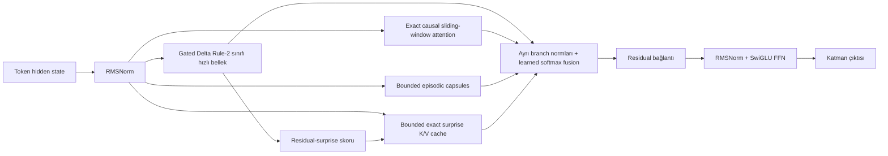

# ALUCLU Araştırma ve Mühendislik Karar Raporu

**Açılım:** Adaptive Layered Unified Context with Learned Updates 
**Kod adı:** `aluclu` 
**Rapor tarihi:** 30 Temmuz 2026 
**Belge türü:** Araştırma kararı, doğrulama sözleşmesi ve deney yol haritası 
**Kanıt düzeyi:** Mevcut uygulama taşınabilir CPU doğruluk/referans backend'idir. Bu belge GPU liderliği, dünya rekoru, SOTA veya enerji üstünlüğü iddia etmez.

## 0. Karar özeti

“Dünyanın en hızlı, en verimli ve en güçlü mimarisi” tek bir sayı ile tanımlanamaz. Kalite, gecikme, throughput, fiziksel durum, bellek trafiği ve enerji çoğu zaman birbirine karşı hareket eder. ALUCLU'nun mühendislik hedefi bu nedenle bir mutlak üstünlük iddiası değil, eşit koşullarda ölçülen bir **Pareto cephesini ilerletme** hedefidir.

Seçilen çekirdek mimari dört tamamlayıcı bellek yolunu bir araya getirir:

1. Her katmanda, Gated DeltaNet-2/KDA sınıfından sabit durumlu ve öğrenilmiş erase/write güncellemeli bir hızlı bellek.
2. Yakın bağlamı kayıpsız işleyen, sabit pencereli tam causal softmax attention.
3. Yakın geçmiş segmentlerini exact faktörler halinde, daha eski segmentleri ise sonlu sayıda düşük-rank arşiv kapsülü halinde tutan bounded episodic bellek.
4. Gated-delta yazma artığı yüksek tokenları sabit kapasitede tutan ve retained K/V çiftlerini exact softmax ile okuyan residual-surprise cache.

Katmanların çıktıları ayrı normalize edilir ve sorguya bağlı öğrenilmiş bir karışımla birleştirilir. Softmax attention ile linear-memory paydalarının aynı şey olduğu varsayılmaz. Bu ayrım hem matematiksel olarak daha temizdir hem de her bellek yolunun tek başına denetlenebilmesini sağlar.

Bu kararın gerekçesi:

- Gated delta sınıfı, tüm geçmişi bağlam uzunluğundan bağımsız yoğun bir duruma sıkıştırır; delta güncellemesi, saf toplamsal fast-weight belleğe göre mevcut eşlemeleri daha kontrollü düzeltir [S1–S5].
- Exact sliding-window attention, recurrent modellerin zorlandığı yakın token kaydırma, karşılaştırma ve kesin lokal recall işlerini korur; Based ve Gated DeltaNet hibritleri bu tamamlayıcılığı destekler [S3, S6].
- Bounded episodic kapsüller, tek yoğun matrise düşen interferansı azaltmak için sonlu ve açık bir kapasite katmanı sunar. Kapasite aşılınca sıkıştırma ve en eski kapsülün değiştirilmesi bilinçli, ölçülebilir bir kayıptır.
- HOLA'nın compressive recurrent state'i bounded exact cache ile tamamlama bulgusu, yoğun state'in açıklayamadığı yüksek yazma artığına sahip tokenları exact tutmanın güçlü bir hipotez olduğunu gösterir [S29]. ALUCLU uygulaması bağımsızdır: GDR2 residual RMS skorunu kullanır ve kapasite dolunca yalnız minimum öncelikten daha yüksek yeni girdiyi kabul eder.
- Büyüyen global KV cache, growing memory checkpoint veya sınırsız segment listesi kullanılmadığı için doygunluk sonrasında fiziksel inference state'i bağlam uzunluğuna göre sabit kalabilir.

Temel sınır da aynı açıklıkla kabul edilir:

> Sonlu hassasiyetli sabit fiziksel durum ile sınırsız sayıda keyfî anahtar–değer ilişkisini kesin olarak hatırlamak birlikte mümkün değildir.

Bu nedenle ALUCLU'nun savunulabilir hedefi “sınırsız exact recall” değil; **sabit ve açıkça raporlanan bir state bütçesi altında, gerçek iş yüklerinde daha iyi kalite–gecikme–trafik–enerji dengesi** üretmektir.

İlk taslak, segment pay/payda toplamları ve identity initialization fikrini gündeme getirdi. Ancak büyüyen segment taraması, sonlu sigmoid ile exact kimlik iddiası ve yapısal non-degradation iddiası korunmamıştır. ALUCLU; isimlendirmesi, denklemleri, durum sözleşmesi ve deney protokolü kendisine ait bağımsız bir mimaridir.

---

## 1. “En iyi” hedefinin ölçülebilir Pareto sözleşmesine çevrilmesi

### 1.1 Karar vektörü

Her model ve konfigürasyon şu vektörle değerlendirilmelidir:

\[
\mathcal{P} =
(\text{kalite}\uparrow,
\text{decode throughput}\uparrow,
\text{TTFT}\downarrow,
\text{TPOT}\downarrow,
\text{state byte}\downarrow,
\text{byte/token}\downarrow,
\text{joule/token}\downarrow)
\]

Bir konfigürasyon, en az bir boyutta daha iyi olup hiçbir boyutta daha kötü değilse diğerini Pareto-domine eder. Gerçekte kalite ile sistem maliyeti çatışacağı için tek kazanan yerine şu kullanım rejimleri ayrı raporlanmalıdır:

- **Edge/CPU:** küçük batch, sınırlı RAM, düşük güç.
- **Interactive GPU:** batch 1–4, düşük TTFT ve p95 TPOT.
- **Throughput GPU:** yüksek batch/concurrency, toplam token/s.
- **Uzun streaming:** state doygun, uzun prompt ve uzun üretim.
- **Recall-ağır:** MQAR/RULER/NoLiMa gibi geçmişe kesin erişim isteyen görevler.
- **Dil modelleme:** gerçek metin validation loss/perplexity ve downstream kalite.

### 1.2 Zorunlu metrik tanımları

| Boyut | Birincil metrik | Hesaplama/raporlama kuralı |
|---|---|---|
| Dil kalitesi | NLL ve perplexity | Aynı tokenizer, veri split'i ve evaluation tokenları; bootstrap güven aralığı |
| Associative recall | Answer accuracy | Mesafe, ilişki sayısı, overwrite ve kapasite oranına göre ayrı bucket |
| Uzun bağlam | RULER/NoLiMa/HELMET skorları | 4K–128K veya model sınırına kadar uzunluk eğrisi; yalnız ortalama değil |
| Decode | token/s ve TPOT | Prefill hariç, doygun state ile; median, p95 ve p99 |
| Prefill | token/s ve TTFT | Prompt alımından ilk logite kadar; model-only ve end-to-end ayrı |
| Fiziksel state | byte/batch ve byte/sequence | Bütün layer, head, local cache, capsule, conv history ve dtype dahil |
| State sabitliği | büyüme eğimi | Doygunluktan sonra \((B(T_2)-B(T_1))/(T_2-T_1)=0\) olmalı |
| Bellek trafiği | DRAM byte/token | Donanım sayaçlarından toplam read+write / üretilen token |
| Enerji | joule/token | \(\int(P(t)-P_\text{idle})dt/N_\text{token}\); örnekleme hızı ve idle tanımı kayıtlı |
| Sayısal kararlılık | NaN/Inf, norm ve hata | Uzun akışta state normları, gradient normları, compression error ledger |

`tensor_tree_bytes` ile ölçülen benzersiz tensor storage byte yararlıdır; fakat Python nesneleri, allocator fragmentasyonu, framework workspace'i ve kernel geçici alanlarını içermez. Bu nedenle aşağıdakiler ayrı verilmelidir:

- Mantıksal state tensor byte,
- PyTorch allocated/reserved peak,
- Süreç RSS veya GPU resident memory,
- Model parametre byte,
- Geçici workspace byte.

### 1.3 Adil karşılaştırma sözleşmesi

Bir “daha hızlı” veya “daha güçlü” sonucu ancak şu değişkenler eşlenirse anlamlıdır:

- Parametre sayısı ve aktif parametre sayısı,
- Eğitim tokenı, veri sırası ve tokenizer,
- Context curriculum ve optimizer,
- Precision ve quantization,
- Batch, prompt uzunluğu ve generation uzunluğu,
- Aynı GPU/CPU, güç limiti, saat politikası ve yazılım sürümleri,
- Eşdeğer kernel olgunluğu,
- State/KV bütçesi veya ayrıca çizilmiş bütçe eğrisi.

ALUCLU Python recurrence'ını FlashAttention-2, FlashKDA veya fused Triton GDN2 ile kıyaslayıp mimari hız sonucu çıkarmak geçersizdir. Mevcut backend doğruluk oracle'ıdır. GPU Pareto iddiası için aynı recurrence'ın doğrulanmış chunkwise/fused uygulaması gerekir.

### 1.4 İlerleme kapıları

| Kapı | Geçme koşulu |
|---|---|
| C0 — Nedensellik | Gelecek token değişikliği prefix çıktısını bit düzeyinde veya ilan edilmiş toleransta değiştirmiyor |
| C1 — Recurrence doğruluğu | Tek seferlik scan, değişken chunk'lar ve token-step çıktıları eşleşiyor |
| C2 — Bounded state | Birden çok archive wrap sonrasında state byte sabit ve slot sınırları aşılmıyor |
| C3 — Sayısal güvenlik | Uzun stress testte NaN/Inf yok; denominator pozitif; error ledger sonlu |
| Q0 — Yararlılık | Eşit bütçeli recurrent-only baseline'a karşı en az bir recall/LM kalite boyutunda tekrarlanabilir kazanç |
| S0 — Sistem değeri | Kalite kazancı, kabul edilen throughput/state/enerji maliyetiyle Pareto-nondominated bir nokta üretiyor |
| G0 — GPU iddiası | Fused kernel doğrulanmış, profiler ile darboğaz ölçülmüş ve en az iki donanımda tekrar edilmiş |

Bu kapılar sonuç değildir; deneylerin başarı ölçütüdür.

---

## 2. Fiziksel ve teorik sınır

### 2.1 Neden sabit state sınırsız exact recall yapamaz?

Associative recall problemini bir one-way communication problemi olarak düşünelim:

1. Akışın ilk kısmı \(N\) bağımsız anahtar–değer ilişkisini kodlar.
2. Model bu kısmı gördükten sonra elinde yalnız recurrent state kalır.
3. Akışın ikinci kısmı keyfî bir anahtarı sorgular.
4. Model ilgili değeri sabit hata olasılığıyla vermelidir.

İlk kısımdaki ilişkiler \(N\) bağımsız biti temsil edecek şekilde seçilebilir. State \(s\) bit ise ilk kısımdan sorgu kısmına yalnız \(s\) bitlik mesaj taşınmış olur. One-way `INDEX`/nearest-neighbor türü iletişim karmaşıklığı alt sınırları, keyfî ilişki ailesini çözmek için \(s=\Omega(N)\) gerektiğini gösterir. Zoology ve Based recall–state ödünleşimini hem deneysel hem teorik olarak inceler; Bhattamishra ve arkadaşları recurrent mimariler ile Transformer'lar arasında linear-vs-logarithmic temsil ayrışmaları verir [S6–S8].

Bu sonuç üç yanlış kaçış yolunu da kapatır:

- **“State reel sayıdır, sonsuz bilgi taşır.”** Fiziksel donanım finite precision, finite enerji ve gürültüyle çalışır.
- **“Düşük rank her şeyi exact saklar.”** Bir segmentin matrisi exact faktörlenebilir; keyfî sayıda bağımsız segmentin toplam bilgi miktarı yine büyür.
- **“Router gerekli segmenti seçer.”** Router'ın seçebilmesi için segmentlerin veya ayırt edici özetlerinin bir yerde saklanması gerekir; keyfî geçmiş için bu bilgi de büyür.

### 2.2 ALUCLU'nun dürüst kapasite tanımı

Mevcut episodic yapılandırmada:

- Segment uzunluğu: \(S\),
- Exact live segment sayısı: \(L\),
- Archive kapsül sayısı: \(A\),
- Kapsül başına birleştirilen segment sınırı: \(C\),
- Archive numerator rank'ı: \(R\).

Ring değişimi öncesinde temsil edilen nominal token ufku:

\[
T_\text{retained}=S(1+L+AC)
\]

olarak hesaplanır. Bu sayı “hepsi exact hatırlanır” anlamına gelmez:

- Current ve live segmentlerin value–positive-key numerator faktörleri exact tutulur.
- Archive numerator'ları rank \(R\)'ye QR + küçük SVD ile truncation geçirir.
- Archive denominator özeti \(z\) ayrı ve exact toplanır.
- Kapsül ring'i dolunca en eski kapsül değiştirilir.

Dolayısıyla fiziksel state doygunluktan sonra sabittir; buna karşılık recall kapasitesi sonlu ve archive kısmı kayıplıdır. Bu, teorik alt sınırla uyumlu ve ölçülebilir bir tasarımdır.

Exact surprise cache bu nominal zaman ufkundan farklı davranır: en yüksek \(C_\text{exact}\) residual önceliği arasına giren çok eski bir token ring dönüşlerinden sonra da kalabilir. Bu, retained olay için exact K/V sağlar; fakat yalnız \(C_\text{exact}\) olay tutulduğu ve admission hard olduğu için alt sınırı değiştirmez.

### 2.3 “O(1)” ifadesinin doğru kullanımı

ALUCLU için “O(1)” yalnız akış uzunluğu \(T\)'ye göredir:

- Gated delta state: \(O(Hd_kd_v)\),
- Local cache: \(O(Wd)\),
- Exact surprise cache: \(O(C_\text{exact}d)\),
- Episodic state: \(O(LSd + ARd + (L+A)Jm)\),
- Token başına exact cache okuması: \(O(C_\text{exact}d)\),
- Token başına capsule taraması: \(O((L+A)\cdot C_\text{slot})\).

`H`, `d_k`, `d_v`, pencere `W`, exact cache kapasitesi, slot bütçesi, rank ve sketch boyutu sabit tutulursa bunlar \(T\)'den bağımsızdır. Ancak sabit katsayılar büyük olabilir. O(1) bellek:

- Küçük bellek,
- Düşük DRAM trafiği,
- Düşük enerji,
- Veya düşük latency

anlamına otomatik olarak gelmez.

Standard causal Transformer için de karmaşıklık doğru ifade edilmelidir:

- Full-attention prefill/training: \(O(T^2d)\),
- KV-cached decode'un \(t\). adımı: \(O(td)\),
- \(T\) tokenlık decode toplamı: \(O(T^2d)\),
- KV state: \(O(TdL_\text{layer})\).

---

## 3. Seçilen ALUCLU mimarisi

### 3.1 Global hızlı bellek: Gated Delta Rule-2 sınıfı

Her layer'da çok başlı bir fast-weight state bulunur:

\[
S_t\in\mathbb{R}^{H\times d_k\times d_v}.
\]

Mevcut referans recurrence:

- Query ve key yönlerini L2 normalize eder,
- Key ekseninde channel-wise erase,
- Value ekseninde channel-wise write,
- Key ekseninde öğrenilmiş channel-wise decay,
- Önce eski eşlemenin okumasını çıkarıp residual değeri yazar,
- Fast-weight accumulator ve decay yolunu FP32 tutar.

Bu tasarım saf toplamsal

\[
S_t=S_{t-1}+k_tv_t^\top
\]

güncellemesinden daha uygundur; çünkü aynı veya benzer key'e yeni value yazıldığında eski eşlemeyi kontrollü biçimde düzeltir. Gated DeltaNet-2, erase ve write kararlarını ayrı eksenlere ayırarak KDA ve önceki Gated DeltaNet'i genelleştirir [S1, S2]. Mevcut kod, makalenin fused WY/chunkwise kernel'i değil, aynı tasarım sınıfındaki token-recurrent doğruluk referansıdır.

**Neden çekirdekte?**

- Durum \(T\)'den bağımsızdır.
- Her token eski belleği hem unutabilir hem düzeltebilir.
- Global özet ve tekrar eden ilişkiler için yüksek arithmetic düzenliliğe sahiptir.
- KDA/Mamba sınıfına kıyasla erase/write ayrımını doğrudan ablate etmek mümkündür.

**Sınırı:** \(Hd_kd_v\) finite kapasitedir; yoğun outer-product state keyfî ilişki sayısını exact saklayamaz.

### 3.2 Exact lokal yol: sliding-window softmax attention

Her `local_attention_every` layer'da son \(W\) tokenın K/V'si tutulur. Attention:

- Causal,
- Tam softmax,
- Sabit rolling pencere,
- FP32 softmax,
- Öğrenilmiş pozitif mesafe cezası

kullanır.

Bu yolun rolü global history saklamak değildir. Yakın token hizalama, kesin kopyalama, kısa bağımlılıklar ve recurrent sıkıştırmanın gereksiz olduğu ilişkiler için kayıpsız bir kısa dönem belleğidir. Based, Infini-attention ve Gated DeltaNet hibrit sonuçları local attention'ın linear/recurrent çekirdeği tamamladığını destekler [S3, S6, S15].

State maliyeti scheduled layer başına, batch başına yaklaşık:

\[
B_\text{local}=2Wd\,b
\]

byte'tır; \(b\), K/V dtype byte sayısıdır.

### 3.3 Bounded episodic kapsüller

Her `episodic_every` layer'da episodic yol açılır. Akış:

1. Tokenlar \(S\) uzunluklu current segmentte birikir.
2. Tamamlanmış en yeni \(L\) segment exact live faktör olarak tutulur.
3. Live sınırı aşılınca en eski segment archive ring'ine girer.
4. Her archive kapsülü en fazla \(C\) segment alır.
5. Numerator faktörleri rank \(R\)'ye truncation geçirir; atılan tail normu `error_bound` ledger'ına eklenir.
6. Ring dolduğunda en eski kapsül değiştirilir.

Pozitif ve bounded feature map:

\[
\phi(x)=f_\text{min}+
(f_\text{max}-f_\text{min})\sigma(x)
\]

denominator'ın pozitif kalmasına yardımcı olur. Numerator düşük-rank sıkıştırılsa bile denominator özeti:

\[
z=\sum_j\phi(k_j)
\]

ayrı saklanır; SVD factoründen denominator türetilmez.

Bu bellek **exact global softmax cache değildir**. Current/live bölüm, linear-attention numerator'ını exact faktörlerle temsil eder; archive bölümü kayıplı düşük-rank kapsüldür. “Episodic” adı, bilgiyi zaman bölmeli açık slotlarda tutmasından gelir.

### 3.4 Bounded exact residual-surprise K/V cache

Her `exact_cache_every` layer'da sabit \(C_\text{exact}\) kapasiteli bir exact cache açılır. Gated-delta güncellemesindeki:

\[
e_t=(w_t\odot v_t)-S'_{t-1}(b_t\odot k_t)
\]

yazma artığının RMS normu:

\[
s_t=\sqrt{\operatorname{mean}(e_t^2)}
\]

token önceliği olarak kullanılır. Cache:

1. Boş kapasite varken her tokenı alır.
2. Dolduktan sonra mevcut minimum öncelikli girdiyi bulur.
3. Yalnız \(s_t>s_\text{min}\) ise o girdiyi yeni K/V ile değiştirir.
4. Retained K/V çiftlerini her sorguda exact causal softmax ile okur.

Böylece cache, geçmiş boyunca görülen en yüksek residual-surprise skorlarına sahip yaklaşık top-\(C_\text{exact}\) token setini tutar. Local attention son \(W\) tokenı recency üzerinden koruduğu için exact cache'in aynı işi tekrar etmesi gerekmez; rolü recurrent belleğin yazarken en çok zorlandığı seyrek olayları saklamaktır.

Bu mekanizma HOLA'nın “compressive state + bounded exact memory” fikrinden motive edilmiştir [S29], fakat HOLA implementasyonunun kopyası değildir. ALUCLU:

- GDR2'nin kendi erase/write residual RMS skorunu kullanır,
- Ayrı learned eviction ağı kurmaz,
- Önceliği `detach` ederek hard admission kararına gradient taşımaz,
- Cache K/V projeksiyonlarını ALUCLU block içinde bağımsız öğrenir.

State maliyeti, cache'in etkin olduğu layer başına:

\[
B_\text{exact-cache}
=2C_\text{exact}d\,b
+4C_\text{exact}
+C_\text{exact}
\]

byte'tır. Son iki terim FP32 priority ve boolean valid mask'tir. Read compute \(O(C_\text{exact}d)\)'dir; kapasite sabitken ikisi de \(T\)'den bağımsızdır.

Bu formül standart fp16/bf16/fp32 çalışma yolunadır. Sayısal doğrulama için
model state'i float64 ise çok yakın skorların sırasını korumak üzere priority
de float64 tutulur ve `4*C_exact` terimi `8*C_exact` olur.

**Hard-selection sınırları:**

- Seçim ve `argmin` türevlenebilir değildir; model cache admission politikasını uçtan uca öğrenmez.
- Residual büyüklüğü bilgi değeriyle aynı değildir. Gürültülü, outlier veya ölçekçe büyük tokenlar faydalı ama düşük residual'lı bilgiyi dışarıda bırakabilir.
- Age decay olmadığı için erken yüksek skorlar cache'i uzun süre dondurabilir.
- Diversity kontrolü olmadığı için semantik olarak tekrar eden yüksek-surprise tokenlar kapasiteyi işgal edebilir.
- Exact kelimesi yalnız retained K/V çiftlerinin softmax okumasını anlatır; hangi tokenların tutulduğu kayıplı ve kapasite \(C_\text{exact}\) ile sınırlıdır.
- Cache dolduktan sonra düşük skorlu bütün yeni bilgi kesin olarak atılır; keyfî eski recall garantisi yoktur.

Bu nedenle surprise policy; recency, FIFO, reservoir/random, learned admission ve diversity-aware seçimle aynı kapasitede ablate edilmelidir. HOLA'nın sonuçları tek yazarlı, Temmuz 2026 tarihli yeni bir preprint bulgusudur; ALUCLU üzerinde bağımsız doğrulama gerekir.

### 3.5 Bounded capsule router ve identity özelliği

Router iki sinyali karıştırır:

- Degree-1 normalize route dot product,
- Homogeneous polynomial kernel için TensorSketch tahmini.

Slot skorları sonlu sayıda current/live/archive slot üzerinde hesaplanır. Slot sayısı:

\[
K_\text{slot}\le 1+L+A
\]

olduğu için büyüyen segment listesi yoktur.

Sıcaklık sıfırken bütün ağırlıklar tam olarak 1'dir; routed sonuç ungated aggregation ile bit düzeyinde aynıdır. Sıcaklık sıfırdan ayrıldığında ağırlıklar pozitif kalır ve:

\[
\sum_i w_i d_i=\sum_i d_i
\]

olacak şekilde denominator mass korunur. Böylece router numerator katkılarını değiştirirken toplam denominator ölçeğini yapay olarak büyütmez veya küçültmez.

Bu özellik ilk taslaktaki `sigmoid(3)≈0.9526` sorununu giderir. Buna rağmen router için bir **kalite tabanı garantisi yoktur**: yanlış slotu güçlendirip doğru slotu bastırabilir. Savunulabilir iddia “ungated çözüme exact başlangıç/geri dönüş noktası vardır”; “asla kötüleşemez” değildir.

### 3.6 Katmanlar arası fusion

Gated-delta, local softmax, exact surprise cache ve episodic linear readout aynı normalizasyon semantiğine sahip değildir. Bu nedenle pay ve paydaları tek bir attention formülünde karıştırmak yerine:

1. Her branch RMSNorm ile ölçeklenir,
2. Her branch'in öğrenilmiş scalar ölçeği vardır,
3. Hidden state'ten softmax fusion ağırlıkları üretilir,
4. Karışım residual kola eklenir.

Fusion projeksiyonu sıfır ağırlık/bias ile başlatıldığı için çok branch'li layer ilk anda uniform karışır. Bu, tek başına gated-delta baseline'ına identity değildir; ayrı ablation gerektirir. Herhangi bir formal non-degradation iddiası yapılmamalıdır.

---

## 4. Mevcut referans uygulamanın kanıt sınırı

| Özellik | Mevcut durum | Doğru yorum |
|---|---|---|
| Token-recurrent gated delta | Var | CPU fallback ve doğruluk oracle'ı |
| Channel-wise decay/erase/write | Var | GDN2 sınıfı recurrence; resmî fused kernel değildir |
| FP32 fast-weight state | Var | Mixed precision altında accumulator kararlılığını artırır |
| Exact fixed-window softmax | Var | Python token loop'lu referans; performans kernel'i değildir |
| Exact current/live segment faktörleri | Var | Linear numerator için exact; global softmax KV değildir |
| QR + küçük SVD archive compression | Var | Archive numerator kayıplıdır; tail error izlenir |
| Bounded archive ring | Var | State ve compression depth akış uzunluğundan bağımsızdır |
| GDR2 residual-surprise skoru | Var | Her token için write residual RMS; information-value oracle'ı değildir |
| Bounded exact surprise K/V cache | Var | Hard top-C-benzeri admission; retained çiftlerde exact causal softmax |
| Sabit cache state allocation | Var | K/V, normal yolda FP32 priority ve valid mask başlangıçta capacity kadar ayrılır; float64 test yolunda priority de float64'tür |
| Cache step/scan ve causality testleri | Var | Referans eşitliği, bounded state ve finite gradient denetlenir |
| Degree-1 + TensorSketch router | Var | Auxiliary routing hipotezi; kalite üstünlüğü ölçülmemiştir |
| Sıfır sıcaklıkta exact ungated eşitlik | Testli | Identity initialization özelliği |
| Denominator mass conservation | Testli | Router denominator ölçeğini korur |
| Scan/chunk/step eşitliği | Testli | Referans recurrence tutarlılığı |
| Causal prefix invariance | Testli | Gelecek bilgi sızıntısı görülmemiştir |
| Doygun state sabitliği | Testli | Yapılandırılmış test uzunluklarında doğrulanmıştır |
| Diagnostic next-token MQAR trainer | Var | Küçük sentetik araştırma aracı; genel LM kanıtı değildir |
| CPU recurrent benchmark | Var | token/s ve state byte üretir; GPU iddiası değildir |
| Fused Triton/CUDA kernel | Yok | Throughput liderliği iddia edilemez |
| Chunkwise parallel training kernel | Yok | Büyük ölçek eğitim verimi henüz gösterilmemiştir |
| Learned/differentiable cache admission | Yok | Mevcut policy detached residual priority ve hard replacement kullanır |
| Age decay veya diversity-aware cache | Yok | Hard top-C'nin donma/duplicate riski deneyle ölçülmelidir |
| Enerji ve DRAM byte/token ölçümü | Yok | Donanım doğrulama planının parçasıdır |

Mevcut testlerin ispat ettiği şey implementasyon invariant'larıdır; model kalitesi değildir. Özellikle state'in sabit olması, saklanan eski bilginin doğru geri çağrıldığını tek başına göstermez.

---

## 5. State ve hesap muhasebesi

### 5.1 Gated delta state

Batch başına, layer başına:

\[
N_\text{GDR2}=Hd_kd_v +(k_\text{conv}-1)d
\]

eleman bulunur. Fast-weight tensor FP32 olduğundan ana terimin byte maliyeti:

\[
B_\text{GDR2}=4Hd_kd_v
\]

olur. Conv history model dtype'ındadır.

Bu state'in her token DRAM'den okunup geri yazılması gerekirse arithmetic intensity düşük olabilir. Gerçek hız için state'in register/shared memory/L2'de tutulduğu fused recurrent/chunk kernel gerekir. Sabit state, bellek bant genişliği problemini kendiliğinden çözmez.

### 5.2 Local attention state

Scheduled layer başına:

\[
N_\text{local}=2Wd
\]

elemandır. Decode compute yaklaşık \(O(Wd)\), state de \(O(Wd)\)'dir. `W` büyüdükçe recall artabilir fakat TPOT ve byte/token da doğrusal artar.

### 5.3 Episodic state

Router dimension \(r\), sketch sayısı \(J\), sketch width \(m\) olsun.

Bir exact live slot:

\[
N_\text{live-slot}=
2Sd+d+r+Jm+2.
\]

Bir archive slot:

\[
N_\text{archive-slot}=
2Rd+d+r+Jm+2.
\]

Doygun episodic state yaklaşık:

\[
N_\text{episodic}=
(L+1)N_\text{live-slot}
A N_\text{archive-slot}
(k_\text{conv}-1)d.
\]

Toplam model state'i, bu terimlerin hangi layer'larda etkin olduğuna ve batch'e göre toplanmalıdır. “Tek modül 0.x MB” toplam model bellek iddiası olarak kullanılmamalıdır.

### 5.4 Exact residual-surprise cache state

Kapasite \(C_\text{exact}\), model width \(d\), model dtype byte sayısı \(b\) için:

\[
B_\text{cache}=
2C_\text{exact}d\,b
+4C_\text{exact}
+C_\text{exact}.
\]

İlk terim exact K/V, ikinci normal fp16/bf16/fp32 çalışma yolundaki FP32
priority, üçüncü boolean valid mask'tir. Float64 doğrulamada ikinci terim
\(8C_\text{exact}\)'tir. Python/PyTorch tensor metadata'sı bu formüle dahil
değildir. Cache state baştan tam kapasitede ayrıldığı için tensor byte ilk
token ile doygun akış arasında değişmez.

Her cache-enabled layer kendi state'ini taşır; toplam maliyet `ceil(n_layers / exact_cache_every)` ile değil, uygulamadaki gerçek scheduled layer sayısı üzerinden toplanmalıdır.

### 5.5 Token başına iş

Mevcut referans uygulamada:

- Gated delta recurrence, zaman ekseninde Python loop ve `einsum`,
- Local attention, her token cache `cat` ve son \(W\) K/V üzerinde softmax,
- Exact residual cache, \(C_\text{exact}\) priority içinden minimum seçim ve retained K/V üzerinde softmax,
- Episodic read, en fazla \(1+L+A\) slot taraması,
- TensorSketch, her sketch ve polynomial degree için CountSketch + FFT,
- Archive sınırında QR/SVD

çalıştırır.

Bu yapı asimptotik olarak bounded olsa da latency düzgün değildir. Archive compression tokenları p95/p99 gecikme sıçraması yaratabilir. Benchmark yalnız median token/s vermemeli; compression boundary ve normal tokenlar ayrı izlenmelidir.

---

## 6. TensorSketch için mühendislik kararı

### 6.1 Sağladığı şey

Normalize route vektörleri \(x,y\) için degree-\(p\) TensorSketch:

\[
\mathbb{E}\left[
\langle TS_p(x), TS_p(y)\rangle
\right]
=(x^\top y)^p
\]

olacak şekilde homogeneous polynomial kernel'i düşük boyutta tahmin eder. CountSketch sonuçlarının FFT alanında çarpılması, açık \(d^p\) tensor feature oluşturmadan polynomial etkileşim sağlar [S16–S18].

Mevcut episodic bellekte her tokenın sketch'i slot içinde toplanır. İç çarpımın lineerliği nedeniyle query sketch ile slot sketch toplamının çarpımı, token-kernel skorlarının toplamını tahmin eder. Bu, slot başına bütün route key'lerini saklamadan yüksek dereceli benzerlik sinyali üretir.

### 6.2 Riskler

1. **Göreli hata:** Beklenen kernel değeri küçükken mutlak sketch gürültüsü sinyale göre büyük olabilir. “Varyans \(O(1/m)\)” ifadesi derece ve açıya bağlı sabitleri gizler.
2. **Eski variance bound:** Pham–Pagh'ın 2025 güncellemesi, 2013 çalışmasının variance bound'unu düzelttiğini açıkça belirtir [S17]. Raporlama düzeltilmiş analiz ve ampirik kalibrasyona dayanmalıdır.
3. **Çift derece:** \(p\) çift ise \(x^\top y=-1\) ve \(+1\) aynı büyüklükte polynomial skora gider. Varsayılan config'teki `p=4` bu sign ambiguity'ye sahiptir; diagnostic scriptlerdeki `p=3` bu özel sorunu taşımaz.
4. **Signed collision:** Gerçek kernel nonnegative olsa dahi sonlu sketch tahmini negatif olabilir.
5. **Median-of-\(J\):** Bağımsız tahminlerin medyanı ağır kuyrukları azaltabilir; Count-Min gibi tek yönlü hata garantisi veya unbiasedlık garantisi vermez.
6. **Slot büyüklüğü etkisi:** Mevcut skorlar `sqrt(count)` ile bölünür. Token başına ortalama benzerlik aynıysa büyük kapsülün skoru yaklaşık \(\sqrt{n}\) ile büyüyebilir; archive slotlar sistematik avantaj kazanabilir.
7. **Hesap maliyeti:** Token başına \(Jp\) CountSketch/FFT ve tüm bounded slotların `Jm` iç çarpımları gerekir. Küçük tensörlerde kernel launch/FFT overhead'i aritmetiğe baskın olabilir.
8. **Semantik shortcut:** Exact MQAR'daki tekrar eden aynı tokenlar polynomial router'ı olduğundan güçlü gösterebilir. Paraphrase ve düşük lexical overlap olmadan semantik routing sonucu çıkarılamaz.

### 6.3 Karar

TensorSketch korunur, fakat **çekirdek başarının önkoşulu değil auxiliary ablation** olarak sınıflandırılır. Kabul koşulu:

- Exact degree-1 dot router,
- Öğrenilmiş düşük boyutlu MLP/bilinear router,
- TensorSketch `p∈{2,3,4}`,
- `m` ve `J` sweep,
- `count` normalizasyonu `{1, sqrt(count), count}`,
- Shifted kernel \(((1+x^\top y)/2)^p\)

ile eşit state ve wall-clock altında karşılaştırılmasıdır.

TensorSketch ancak NoLiMa, indirect/paraphrastic MQAR ve gerçek wall-clock Pareto'sunda kazanırsa varsayılan router yapılmalıdır. Sketch boyutu veya derece yükseltilerek kazanılan kalite, state byte ve byte/token hesabına eksiksiz eklenmelidir.

---

## 7. Güçlü alternatifler ve çekirdeğe alınmama nedenleri

| Alternatif | Güçlü yanı | Temel maliyet/sınır | ALUCLU'daki rol |
|---|---|---|---|
| Full Transformer + FlashAttention-2 | En güçlü exact content-addressable üst sınır; olgun kernel | KV state bağlamla büyür, decode bellek trafiği artar | Kalite ve sistem üst-sınır baseline'ı |
| Kimi Linear, 3:1 KDA/MLA | Güçlü yayımlanmış kalite ve uzun-context sistem sonucu; olgun KDA kernel'i [S4, S23] | Periodic global MLA nedeniyle strict sabit state değildir; yayın rakamları kendi donanım/ölçeğine aittir | Kalite-öncelikli P1 hibrit baseline |
| Saf Gated DeltaNet-2 | Basit sabit state, güçlü güncel sonuç, resmî chunkwise/Triton yaklaşımı [S1, S2] | Tek yoğun state finite recall kapasitesine sahiptir | ALUCLU çekirdek branch'i ve en önemli ablation |
| Mamba-3 MIMO | State verimliliği, state tracking ve resmî kernel kodu [S10, S24] | Explicit episodic/capsule recall yolu yok; farklı recurrence semantiği | Zorunlu P1 recurrent baseline |
| Based | Basit linear attention + SWA; açık recall/state Pareto analizi [S6] | Küçük Taylor feature belleğinin global recall kapasitesi sınırlı | Basit ve yorumlanabilir P0/P1 baseline |
| Infini-attention | Local attention + bounded compressive linear memory'yi tek blokta birleştirir [S15] | Global özet interferansa açık; delta erase/write ve açık capsule error ledger yok | En yakın tarihsel hibrit baseline |
| Native Hybrid Attention | RNN slotları ile local tokenları tek softmax altında sorgular [S13] | Yeni preprint; bağımsız kernel/ölçek tekrarı ve bounded konfigürasyon doğrulaması gerekir | P1 mimari baseline; başarılıysa fusion alternatifi |
| Memory Caching | RNN hidden-state checkpointleriyle recall kapasitesini artırır [S11] | Cache sayısı bağlamla büyüdüğünde strict sabit fiziksel state bozulur | Quality-vs-growing-memory kontrolü |
| HOLA | Delta state + residual-selected bounded exact KV cache; ALUCLU surprise lane'inin birincil motivasyonu [S29] | Çok yeni, tek yazarlı preprint; hard seçimin finite capacity ve bias sınırları var | Zorunlu exact-cache baseline/ilham |
| Sparse Delta Memory | Büyük sabit state'i sparse okuyup yazar; isoFLOP altında kapasiteyi artırmayı hedefler [S12] | Çok yeni çalışma; büyük sabit MB, addressing ve özel kernel maliyeti | P1/P2 opsiyonel büyük-kapasite lane |
| ARMT | Lokal Transformer + segment recurrence; çok uzun task-specific reasoning sonucu [S14] | BABILong sonucu task-specific fine-tuning'e bağlı; genel LM ve sistem Pareto'su ayrı doğrulanmalı | Uzun görev eğitimi baseline |
| PolySketchFormer | Polynomial attention sketch'inin sequence modellemede kullanılabildiğini gösterir [S18] | Segment/capsule routing doğruluğunu kanıtlamaz; approximation ve FFT maliyeti vardır | Router/feature ablation kaynağı |

### 7.1 Neden KDA/MLA hibriti doğrudan çekirdek seçilmedi?

Kimi Linear'ın 3:1 KDA-to-global-MLA düzeni kalite-öncelikli çok güçlü bir referanstır [S4]. Fakat global MLA layer'larının KV state'i context ile büyür. Bu mimari:

- “En iyi kalite” kontrolü olabilir,
- KV kullanımını full-attention'a göre azaltabilir,
- Strict \(T\)-independent state kanıtı olamaz.

ALUCLU'nun araştırma sorusu daha dardır: global full-attention cache olmadan hangi Pareto noktası elde edilebilir?

### 7.2 Neden büyük sparse memory hemen eklenmedi?

Sparse Delta Memory, teorik alt sınırla uyumlu biçimde kapasiteyi gerçekten yükseltir: state sabit kalır ama sabit katsayısı büyür [S12]. Buna karşılık:

- Addressing kalitesi ayrı bir zor problemdir,
- Random/learned slot erişimi donanımda düzensiz olabilir,
- Mevcut küçük CPU oracle'ına eklenmesi ana hipotezi bulanıklaştırır,
- Temmuz 2026 itibarıyla çok yeni bir preprinttir.

Önce dört-lane ALUCLU'nun faydası gösterilmeli; sonra dense fast-weight state yerine veya yanına SDM, aynı byte bütçesinde ablate edilmelidir.

### 7.3 HOLA ve ALUCLU exact cache ilişkisi

HOLA, delta-rule compressive state'in yazmakta zorlandığı ilişkileri bounded exact KV cache'e ayırır ve seçim sinyali olarak state'e commit edilen residual büyüklüğünü kullanır [S29]. Bu fikir ALUCLU'nun exact surprise lane'i için birincil bilimsel motivasyondur.

ALUCLU uygulaması yine de ayrı bir deney nesnesidir:

- HOLA checkpoint'i veya kodu üzerine kurulmamıştır.
- GDR2'nin channel-wise erase/write recurrence'ından çıkan RMS residual kullanılır.
- Cache her yapılandırılmış ALUCLU layer'ında ayrı K/V projections ve fusion branch'ine sahiptir.
- Admission hard ve detached'dır; yalnız seçilen K/V yolları gradient alır.
- Local attention recency lane'i ayrı kaldığı için cache yüksek-surprise olaylara ayrılabilir.

Bu nedenle HOLA'nın yazar tarafından bildirilen perplexity veya RULER kazançları ALUCLU sonucu değildir. Doğru karşılaştırma; GDR2-only, GDR2+recency cache, GDR2+residual cache, HOLA yeniden üretimi ve tam ALUCLU arasında eşit kapasite/eğitim koşuludur.

---

## 8. Mimari karar matrisi

Dereceler göreli mühendislik değerlendirmesidir; ölçülmüş benchmark sonucu değildir.

| Aday | \(T\)'ye göre sabit state | Exact yakın bağlam | Uzun recall kapasitesi | Kernel kanıtı | Uygulama riski | Karar |
|---|---:|---:|---|---|---|---|
| **ALUCLU: GDR2 + SWA + capsules + surprise cache** | Evet | Evet | Orta-yüksek aday; açık bounded kapasite | CPU oracle var, fused yok | Yüksek | Ana araştırma adayı |
| Saf Gated DeltaNet-2 | Evet | Hayır | Orta-düşük | Resmî güncel kod/kernels | Orta | P0/P1 ana baseline |
| HOLA | Evet | Exact selected cache | Orta-yüksek aday | Yeni preprint | Orta-yüksek | Surprise-lane ana baseline |
| Saf KDA | Evet | Hayır | Orta | Resmî KDA/FlashKDA | Orta | P1 ana baseline |
| Kimi KDA/MLA 3:1 | Hayır | Evet | Yüksek | Güçlü resmî sistem kanıtı | Yüksek ölçek maliyeti | Quality-first üst sınır |
| Mamba-3 MIMO | Evet | Conv/local | Orta | Resmî kernel | Orta | P1 zorunlu baseline |
| Based | Evet, pencere sabitse | Evet | State bütçesine bağlı | IO-aware kernel çalışması | Düşük-orta | Basit Pareto baseline |
| NHA, slot/window cap ile | Evet | Evet | Orta-yüksek aday | Yeni kod/preprint | Orta-yüksek | P1 karşı mimari |
| Memory Caching | Genelde hayır | Modele bağlı | Cache ile büyür | Araştırma koduna bağlı | Orta | Growing-memory kontrolü |
| Sparse Delta Memory | Evet | Hayır | Büyük sabit kapasite | Çok yeni | Yüksek | İkinci aşama |
| Full Transformer | Hayır | Evet | Context içi yüksek | En olgun | Yüksek KV maliyeti | Kalite üst sınırı |

Seçim gerekçesi bir “toplam puan” değildir. ALUCLU, yalnızca şu araştırma kesişimini aynı anda test ettiği için seçilmiştir:

- Strict bounded physical state,
- Exact kısa dönem erişim,
- Öğrenilmiş yoğun global güncelleme,
- Residual-surprise ile seçilmiş bounded exact K/V erişimi,
- Sonlu açık episodic kapasite,
- Her yolun bağımsız ölçülebilir olması.

---

## 9. P0 benchmark matrisi: doğruluk ve küçük ölçek karar kapısı

P0 testleri mevcut CPU referans backend ile çalışmalı ve büyük eğitim yatırımı öncesinde tamamlanmalıdır.

| P0 deney | Modeller/ablation | Sweep | Birincil metrik | Geçme yorumu |
|---|---|---|---|---|
| Recurrence eşitliği | Her branch ve full model | Chunk bölmeleri: 1, asal, rastgele, tam uzunluk | Max/mean absolute error | İlan edilen dtype toleransında aynı |
| Causal prefix | Full model | Gelecek suffix'i çoklu seed ile değiştir | Prefix max error | Sıfır veya açıklanan deterministik tolerans |
| State doygunluğu | Full model | \(0.5,1,2,4,8\times T_\text{retained}\) | Tensor byte ve büyüme eğimi | Doygunluk sonrası eğim sıfır |
| Archive wrap | Episodic | En az 10 tam ring turu | Slot sayısı, cursor, error ledger | Sınırlar aşılmıyor; NaN/Inf yok |
| Compression doğruluğu | Episodic | Rank 1…min(S,d) | Gerçek Frobenius hata / ledger | Ledger atılan tail'i alt tahmin etmiyor |
| Exact cache top-C | Residual cache | Artan/azalan, tie ve outlier priority akışları | Retained priority/KV | Capacity sonrası doğru minimum replacement |
| Exact cache recurrence | Residual cache | Full scan, token-step, rastgele chunk | Output/state error | İlan edilen toleransta aynı |
| Exact cache bounded state | Residual cache | 1–1M token | State byte | Başlangıçtan itibaren sabit |
| Diagnostic MQAR | Transformer, SWA, GDR2, HOLA-benzeri cache, episodic, ALUCLU | Pair/query/gap/vocab ve kapasite oranı | Answer accuracy ve NLL | Bütün eğri raporlu; tek kolay nokta yok |
| Overwrite MQAR | Aynı | Aynı key'e 2–8 yeni value | Son yazım doğruluğu | Delta erase/write yararı ölçülüyor |
| Indirect/paraphrase recall | Aynı | Lexical overlap bucket | Accuracy | Exact-token shortcut ayrıştırılıyor |
| Router | Ungated, dot, learned, TensorSketch | \(p,m,J\), count norm | Accuracy, state, wall-clock | Sketch yalnız Pareto kazanırsa tutulur |
| Cache admission | Residual, recency, FIFO, reservoir, random | Cache capacity ve age | Accuracy, retention age, wall-clock | Residual seçimin özgül katkısı ayrışır |
| CPU streaming | Bütün ana modeller | Batch 1/4/16; kısa ve doygun state | tok/s, TPOT p50/p95/p99, state byte | Referans maliyet eğrisi; liderlik iddiası yok |
| Sayısal stress | Full model | FP32/BF16; 100K–1M token | NaN/Inf, state norm, denom min | Uzun akışta sonlu ve bounded |

### 9.1 MQAR protokolü

Mevcut diagnostic generator yararlıdır, fakat tek başına yeterli değildir. Zoology'nin resmî MQAR tanımı ve koduyla uyumlu bir protokol kurulmalıdır [S7, S25]:

- `n_pairs`: log ölçekli sweep,
- `n_queries`: tek ve çoklu query,
- Query/key mesafesi,
- Vocab büyüklüğü ve collision oranı,
- Aynı key'e overwrite,
- Query'den önce birden çok archive wrap,
- Exact token, indirect identity ve paraphrase,
- Sonuçların `T/T_retained` oranına göre bucket'lanması.

Her model en az beş seed ile değerlendirilmelidir. Accuracy farkı için paired bootstrap veya uygun oran güven aralığı verilmelidir.

### 9.2 P0 ilerleme eşiği

Bir sonraki ölçeğe geçmek için:

1. C0–C3 invariant kapıları eksiksiz geçmeli.
2. Eşit parametre ve state sınıfında ALUCLU en az bir zor recall rejiminde GDR2-only modelin güven aralığı dışında üstünde olmalı.
3. Bu kazanç, decode p95 TPOT'ta yüzde 10'dan fazla maliyet yaratıyorsa ayrıca daha düşük state veya daha yüksek kaliteyle Pareto gerekçesi sunmalı.
4. TensorSketch eklenmesi, dot/learned router'a karşı hem accuracy hem wall-clock/state hesabıyla savunulmalı; aksi halde daha basit router seçilmeli.

Yüzde 10 eşiği bilimsel sabit değil, büyük ölçek yatırımı için önceden belirlenmiş mühendislik kapısıdır.

---

## 10. P1 benchmark matrisi: ölçek, gerçek görev ve sistem kanıtı

P1 ancak P0 kapıları geçildikten ve fused/chunkwise kernel doğrulandıktan sonra anlamlıdır.

### 10.1 Model karşılaştırma seti

- Transformer++ + FlashAttention-2,
- Sabit-pencere Transformer,
- Based,
- Saf Gated DeltaNet-2,
- Saf KDA,
- HOLA veya eşdeğer resmî yeniden üretim,
- Mamba-3 SISO/MIMO,
- ALUCLU,
- NHA veya Infini-attention,
- Kaynak elverirse KDA/MLA 3:1 quality-first kontrolü.

İlk pilot 100–200M parametre sınıfında çalıştırılabilir. Sonuç kalıcıysa 1B sınıfına çıkılır. Büyük koşu, küçük koşuyla aynı veri/tokenizer/optimizer ve önceden kayıtlı evaluation protokolünü kullanmalıdır. Gated DeltaNet-2'nin 1.3B/100B-token sonucu doğrudan ALUCLU sonucu sayılmaz; aynı koşulda tekrar veya açıkça işaretlenmiş dış referans gerekir [S1].

### 10.2 Kalite matrisi

| Benchmark | Öncelik | Neyi ölçer? | Uzunluk/bütçe sweep | Rapor |
|---|---|---|---|---|
| Gerçek metin NLL/perplexity | P1-zorunlu | Genel dil modelleme | Eğitim context'i ve 2–8× extrapolation | Token-ağırlıklı NLL, ppl |
| Zoology MQAR | P1-zorunlu | Çoklu associative recall | State cap'in altı ve üstü | Accuracy vs length/capacity |
| RULER [S19] | P1-zorunlu | Multi-key, multi-hop, aggregation | 4K, 8K, 16K, 32K, 64K, 128K | Task ve uzunluk bazlı skor |
| NoLiMa [S21] | P1-zorunlu | Literal eşleşmesiz latent retrieval | 1K–128K | Short-baseline'a göre göreli düşüş |
| HELMET [S20] | P1-zorunlu | Uygulama odaklı uzun bağlam | Desteklenen uzunluklar | Kategori bazlı skor; yalnız ortalama değil |
| BABILong [S22] | P1-ikincil | Haystack içinde çok-adımlı reasoning | 100K–10M | Task-specific fine-tuning ayrı etiketli |
| Downstream commonsense/reasoning | P1 | Genel kapasite | Sabit evaluation | Accuracy ve confidence interval |

NIAH tek başına başarı ölçütü değildir. RULER, vanilla NIAH'ı multi-key, tracing ve aggregation ile genişletir; HELMET ise sentetik NIAH skorlarının uygulama performansını zayıf tahmin edebildiğini gösterir [S19, S20].

### 10.3 Sistem matrisi

| Senaryo | Prompt | Generation | Batch/concurrency | Metrikler |
|---|---:|---:|---:|---|
| Interactive kısa | 512–4K | 128–512 | 1 | TTFT, p50/p95 TPOT, joule/token |
| Interactive uzun | 16K–128K | 256–1K | 1 | TTFT, state/KV byte, decode tok/s |
| Throughput | 4K–32K | 256 | 4–64 | Aggregate tok/s, GPU utilization |
| Saturated streaming | \(>8\times T_\text{retained}\) | 4K+ | 1/4 | State slope, p99 compression latency |
| Prefill | 1K–128K | 1 | 1/8 | Prefill tok/s, TTFT, peak memory |
| Decode-only | Doygun state snapshot | 1K | 1/8/32 | tok/s, DRAM byte/token, energy |

Her grafik en az şu eksenlerden ikisini birlikte göstermelidir:

- Quality vs state MB,
- Quality vs TPOT,
- Quality vs joule/token,
- Throughput vs context,
- TTFT vs prompt length,
- DRAM byte/token vs state budget.

---

## 11. Ablation planı

| Ablation | İzole edilen hipotez | Ana ölçümler |
|---|---|---|
| GDR2 only | Yoğun recurrent çekirdeğin tabanı | LM loss, MQAR, state, tok/s |
| SWA only | Exact lokal yolun katkısı | Yakın/uzak recall ayrımı |
| GDR2 + SWA | Based/GDN hibrit etkisi | Quality–state Pareto |
| Episodic only | Capsule kapasitesi | Recall vs cap, compression error |
| GDR2 + capsules | Lokal softmax olmadan global/capsule sinerjisi | Uzak recall, TPOT |
| SWA + capsules | Delta recurrence olmadan explicit memory | Recall türü bazlı fark |
| GDR2 + exact cache | HOLA-benzeri complement etkisi | Recall, cache hit/age, state |
| GDR2 + SWA + exact cache | Recency ve surprise görev ayrımı | Yakın/uzak recall, TPOT |
| GDR2 + capsules + exact cache | İki uzun-dönem lane'in tamamlayıcılığı | Recall vs state |
| Full ALUCLU | Dört bellek yolunun birleşimi | Tüm Pareto metrikleri |
| Archive kapalı | Exact live segmentsin tek başına etkisi | Cap sonrası düşüş |
| Routing kapalı | Router'ın gerçek katkısı | Quality ve latency |
| Degree-1 only | En basit router | Quality, byte/token |
| TensorSketch | Polynomial sinyal | \(p,m,J\) kalite/maliyet eğrisi |
| Rank sweep | Compression kapasitesi | Error ledger, recall, state |
| Window sweep | Exact yakın bağlam bütçesi | TTFT/TPOT/recall |
| Live/archive bütçe sweep | Exact-vs-compressed state tahsisi | Pareto frontier |
| Fusion uniform/fixed/learned | Dynamic branch selection | Quality, entropy, kararlılık |
| Cache capacity sweep | Exact retained olay bütçesi | Quality, state, \(O(Cd)\) read maliyeti |
| Residual/recency/FIFO/reservoir | Hard admission politikasının değeri | Recall age curve, diversity, latency |
| Priority age decay açık/kapalı | Cache donması riski | Retention yaşı, yeni bilgi recall |
| Duplicate/diversity kontrolü | Top-C kapsama riski | Unique semantic cluster ve kalite |
| FP32/BF16 state | Hassasiyet–trafik dengesi | Drift, NaN, byte/token |
| FIFO/ring politikası | Mevcut deterministic retention | Recall age curve |

Her ablation aynı seed seti ve training tokenı ile yapılmalı; parametre farkı varsa ek projection parametreleri raporlanmalı. Yalnız en iyi seed veya en iyi context noktası seçilmemelidir.

---

## 12. Donanım doğrulama planı

### 12.1 Ölçüm katmanları

1. **Operator microbenchmark:** GDR2 update, local attention, sketch, QR/SVD.
2. **Block benchmark:** Tek ALUCLU block; state sıcak ve doygun.
3. **Model-only benchmark:** Embedding–blocks–LM head dahil.
4. **End-to-end serving:** Tokenization, scheduler, batching ve sampling dahil.

Mimari iddia için model-only; ürün iddiası için end-to-end sonuç gerekir. İkisi karıştırılmamalıdır.

### 12.2 Tekrarlanabilirlik

- Git commit veya kaynak arşiv hash'i,
- Model config ve state formülü,
- PyTorch/CUDA/driver/compiler sürümleri,
- GPU/CPU modeli, VRAM/RAM, güç limiti,
- Precision, quantization ve matmul policy,
- Kernel mode ve compile flag,
- Batch, prompt/generation ve seed,
- Warm-up süresi ve tekrar sayısı

çıktı artifact'ına yazılmalıdır.

GPU saatleri ve güç limiti sabitlenebiliyorsa sabitlenmeli; aksi durumda observed clocks/temperature kaydedilmelidir. Termal dengeye ulaşmadan ölçüm başlanmamalıdır.

### 12.3 Zamanlama protokolü

- GPU işlemlerinden önce/sonra explicit synchronize,
- En az bir state doygunluk warm-up'ı,
- Normal token ve archive-compression tokenlarının ayrı etiketlenmesi,
- En az 30 tekrar veya yeterli uzun sürekli koşu,
- Median, p5/p95/p99 ve bootstrap confidence interval,
- İlk derleme/autotune süresinin TTFT'den ayrı raporlanması,
- CUDA Graph açık/kapalı durumunun belirtilmesi.

### 12.4 Byte/token

NVIDIA Nsight Compute/Systems veya eşdeğer donanım sayaçlarıyla:

- DRAM read/write byte,
- L2 hit rate,
- Achieved bandwidth,
- Kernel occupancy,
- Tensor-core utilization,
- Launch sayısı,
- SVD/FFT'nin toplam zaman payı

ölçülmelidir. Teorik tensor boyutunu ikiyle çarpmak gerçek byte/token yerine geçmez; cache reuse ve geçici workspace donanım sayacından görülmelidir [S27].

### 12.5 Enerji

GPU gücü NVML veya laboratuvar tipi haricî güç ölçerle örneklenir [S28]. Protokol:

1. Aynı clock/power limitte idle güç ölç,
2. Ölçüm süresince güç örneklerini zaman damgalı al,
3. Idle üstü enerjiyi trapezoidal integrasyonla hesapla,
4. Üretilen gerçek token sayısına böl,
5. Mean/median ve confidence interval raporla.

Kısa microbenchmark'larda NVML örnekleme çözünürlüğü yetersiz olabilir; bu durumda uzun tekrarlı koşu veya haricî ölçüm gerekir. CPU için RAPL mevcutsa package/DRAM domainleri ayrı raporlanmalıdır.

### 12.6 GPU liderlik iddiası için ek koşul

Mevcut token-loop backend ile GPU sonucu yayınlanmamalıdır. Önce:

- Token recurrence ile chunkwise formül eşitliği,
- Forward ve backward gradient eşitliği,
- Fused kernel için dtype toleransı,
- Variable-length ve state carry,
- Archive/FFT/SVD yollarının kernel profili,
- En az H100 sınıfı ve ikinci bir GPU mimarisi

doğrulanmalıdır. İkinci donanım yoksa sonuç yalnız test edilen GPU için geçerli yazılmalıdır.

---

## 13. Eğitim ve doğrulama sırası

### Aşama A — İnvariant ve sentetik teşhis

- Mevcut unit testler bütün desteklenen dtype/device kombinasyonlarına genişletilir.
- MQAR, state cap'in katlarına kadar uzatılır.
- Archive ring birden çok kez sarılır.
- Error ledger ile gerçek dense reconstruction hatası karşılaştırılır.

### Aşama B — Küçük gerçek dil modeli

- Eşit parameter/token bütçesinde Transformer, SWA, GDR2 ve ALUCLU.
- Aynı tokenizer ve veri sırası.
- Kısa context pretraining ile optimizasyon kararlılığı.
- Sonra context ve carried-state curriculum.

Mevcut diagnostic trainer her batch'te sıfır state ile tam sentetik sekansı işler. Gerçek streaming eğitimi için state'in batch/chunk sınırları arasında kontrollü taşınması, random reset ve truncated BPTT gerekir. Reset ve detach politikası veri doküman sınırlarını ihlal etmemelidir.

### Aşama C — Compression-aware curriculum

- Başlangıçta cap altı örnekler,
- Ardından live eviction,
- Sonra çoklu archive merge,
- En son birden çok ring wrap.

Model yalnız eviction görmeyen uzunluklarda eğitilirse archive yolu test zamanında dağılım dışı kalır.

### Aşama D — Ölçek ve distillation

Full-attention öğretmenden logit veya representation distillation ayrı ablation olabilir. Öğretmen, finite öğrenci state'ine keyfî context bilgisini eksiksiz aktaramaz; distillation teorik alt sınırı değiştirmez. Kazanç varsa training yöntemi olarak raporlanmalıdır.

### Aşama E — Kernel

Mimari P0 kalite kapısını geçmeden fused kernel yatırımı yapılmamalıdır. Kalite geçtikten sonra:

1. GDR2 chunkwise form,
2. Bounded local attention kernel,
3. Slot read fusion,
4. Sketch ve compression hotspot optimizasyonu

profil sırasına göre ele alınmalıdır. En pahalı olduğu ölçülmeyen bileşen önceden optimize edilmemelidir.

---

## 14. İddia politikası

### Mevcut kodla söylenebilecekler

- ALUCLU, yapılandırılan pencere ve slot bütçeleri sabitken context-length-independent inference state tutan bir araştırma prototipidir.
- Token-step, chunked scan, causal prefix ve state saturation invariant'ları mevcut test kapsamlarında denetlenmektedir.
- Gated-delta fast-weight accumulator FP32'dir.
- Local attention causal ve sabit pencerede exact softmax'tır.
- Current/live episodic numerator faktörleri exact; archive numerator'ları bounded-rank kayıplı sıkıştırmadır.
- GDR2 write residual RMS, hard ve detached admission önceliği olarak kullanılmaktadır.
- Exact cache baştan sabit kapasitede ayrılır; retained K/V çiftlerini causal softmax ile okur.
- Exact cache seçimi top-C-benzeri ve kayıplıdır; exact niteliği yalnız retained çiftlerin değerlerine/okumasına ilişkindir.
- Router sıfır sıcaklıkta ungated episodic aggregation'a exact eşittir ve nonzero sıcaklıkta denominator mass'ı korur.
- Mevcut benchmark taşınabilir recurrent doğruluk backend'ini ölçer.

### Ölçümden önce söylenmemesi gerekenler

- Dünyanın en hızlı, güçlü veya verimli mimarisi,
- SOTA kalite veya throughput,
- FlashAttention/KDA/Mamba'dan hızlı,
- Fused GPU kernel hazır,
- Enerji veya byte/token üstünlüğü,
- Sınırsız exact recall,
- Compression kayıpsız,
- Router kaliteyi düşüremez,
- Surprise cache'in sınırsız veya öğrenilmiş admission yaptığı,
- Tek layer/state rakamının toplam model belleği olduğu.

### Sonuç cümlesi şablonu

Gelecekte bir sonuç yayınlanırken en güçlü savunulabilir biçim şöyledir:

> “ALUCLU-\(X\), \(Y\) parametre ve \(Z\) MB doygun inference state bütçesinde, aynı eğitim ve donanım koşullarındaki \(B\) baseline'ına göre \(Q\) görevinde \(\Delta\) kalite farkı ve \(L\) p95 TPOT üretmiş; ölçülen Pareto setinde nondominated kalmıştır.”

Bu ifade bağlamı, bütçeyi, baseline'ı ve ölçümü birlikte verir; evrensel üstünlük iddiası yapmaz.

---

## 15. Karar ve doğrulama planı özeti

### Mimari karar

ALUCLU'nun çekirdeği korunmalıdır:

- Her layer'da GDN2/KDA sınıfı learned-update fast memory,
- Belirli layer aralığında exact bounded sliding-window attention,
- Daha seyrek layer'larda exact-live + low-rank bounded archive capsules,
- Yapılandırılmış layer'larda hard residual-surprise selected bounded exact K/V cache,
- Ayrı normalize edilen branch'ler üzerinde learned fusion.

TensorSketch varsayılan başarı koşulu değil, router ablation'ıdır. Residual-surprise exact cache mevcut çekirdektir; learned admission, age/diversity politikaları ve Sparse Delta Memory daha sonraki ayrı karar kapılı deneylerdir.

### En yakın üç kanıt hedefi

1. State cap'in 8 katına uzanan MQAR ve archive-wrap testlerinde correctness/recall eğrisi.
2. GDR2-only, GDR2+exact-cache, SWA-only ve full ALUCLU'nun eşit bütçeli kalite–state–CPU latency Pareto'su.
3. Residual admission'ın recency/FIFO/reservoir'a ve TensorSketch'in exact dot/learned router'a karşı kalite ve gerçek wall-clock maliyeti.

### GPU'ya geçiş koşulu

ALUCLU P0'da nondominated bir nokta göstermeden GPU liderliği çalışmasına geçilmez. Geçerse chunkwise/fused kernel, profiler tabanlı byte/token ve joule/token ölçümüyle doğrulanır.

---

## 16. Birincil kaynaklar

Tüm bağlantılar **30 Temmuz 2026** tarihinde erişilmiştir. ArXiv kaynakları için belirtilen sonuçların bir kısmı peer review tamamlanmamış preprint bulgularıdır; özellikle 2026 çalışmalarının sonuçları ALUCLU üzerinde bağımsız olarak tekrarlanmalıdır.

### Recurrent/linear attention ve hibrit mimariler

- **[S1]** Hatamizadeh, Choi, Kautz, *Gated DeltaNet-2: Decoupling Erase and Write in Linear Attention*, arXiv:2605.22791. <https://arxiv.org/abs/2605.22791> — Erişim: 30 Temmuz 2026.
- **[S2]** NVIDIA Research, *GatedDeltaNet-2 Official PyTorch Implementation*. <https://github.com/NVlabs/GatedDeltaNet-2> — Erişim: 30 Temmuz 2026.
- **[S3]** Yang, Kautz, Hatamizadeh, *Gated Delta Networks: Improving Mamba2 with Delta Rule*, ICLR 2025. <https://openreview.net/forum?id=r8H7xhYPwz> — Erişim: 30 Temmuz 2026.
- **[S4]** Kimi Team vd., *Kimi Linear: An Expressive, Efficient Attention Architecture*, arXiv:2510.26692. <https://arxiv.org/abs/2510.26692> — Erişim: 30 Temmuz 2026.
- **[S5]** Schlag, Irie, Schmidhuber, *Linear Transformers Are Secretly Fast Weight Programmers*, ICML 2021. <https://proceedings.mlr.press/v139/schlag21a.html> — Erişim: 30 Temmuz 2026.
- **[S6]** Arora vd., *Simple Linear Attention Language Models Balance the Recall-Throughput Tradeoff*, ICML 2024. <https://proceedings.mlr.press/v235/arora24a.html> — Erişim: 30 Temmuz 2026.
- **[S9]** Katharopoulos vd., *Transformers are RNNs: Fast Autoregressive Transformers with Linear Attention*, ICML 2020. <https://proceedings.mlr.press/v119/katharopoulos20a.html> — Erişim: 30 Temmuz 2026.
- **[S10]** Lahoti vd., *Mamba-3: Improved Sequence Modeling using State Space Principles*, arXiv:2603.15569. <https://arxiv.org/abs/2603.15569> — Erişim: 30 Temmuz 2026.
- **[S11]** Behrouz vd., *Memory Caching: RNNs with Growing Memory*, arXiv:2602.24281. <https://arxiv.org/abs/2602.24281> — Erişim: 30 Temmuz 2026.
- **[S12]** Cabannes vd., *Sparse Delta Memory: Scaling the State of Linear RNNs through Sparsity*, arXiv:2607.07386. <https://arxiv.org/abs/2607.07386> — Erişim: 30 Temmuz 2026.
- **[S13]** Du vd., *Native Hybrid Attention for Efficient Sequence Modeling*, arXiv:2510.07019. <https://arxiv.org/abs/2510.07019> — Erişim: 30 Temmuz 2026.
- **[S14]** Rodkin vd., *Associative Recurrent Memory Transformer*, arXiv:2407.04841. <https://arxiv.org/abs/2407.04841> — Erişim: 30 Temmuz 2026.
- **[S15]** Munkhdalai, Faruqui, Gopal, *Leave No Context Behind: Efficient Infinite Context Transformers with Infini-attention*, arXiv:2404.07143. <https://arxiv.org/abs/2404.07143> — Erişim: 30 Temmuz 2026.
- **[S23]** Moonshot AI, *Kimi-Linear Official Repository*. <https://github.com/MoonshotAI/Kimi-Linear> — Erişim: 30 Temmuz 2026.
- **[S24]** State Spaces, *Mamba Official Repository*, Mamba-3 implementation dahil. <https://github.com/state-spaces/mamba> — Erişim: 30 Temmuz 2026.
- **[S29]** Cui, *A Hippocampus for Linear Attention: An Exact Memory for What the Recurrent State Forgets (HOLA)*, arXiv:2607.02303. <https://arxiv.org/abs/2607.02303> — Erişim: 30 Temmuz 2026.

### Recall kapasitesi ve teorik sınırlar

- **[S7]** Arora vd., *Zoology: Measuring and Improving Recall in Efficient Language Models*, arXiv:2312.04927. <https://arxiv.org/abs/2312.04927> — Erişim: 30 Temmuz 2026.
- **[S8]** Bhattamishra vd., *Separations in the Representational Capabilities of Transformers and Recurrent Architectures*, NeurIPS 2024. <https://proceedings.neurips.cc/paper_files/paper/2024/hash/3f630b20b7b3ac76d3a0016fe29b6dc0-Abstract-Conference.html> — Erişim: 30 Temmuz 2026.
- **[S25]** HazyResearch, *Zoology Official Repository*. <https://github.com/HazyResearch/zoology> — Erişim: 30 Temmuz 2026.

### TensorSketch ve polynomial attention

- **[S16]** Pham, Pagh, *Fast and Scalable Polynomial Kernels via Explicit Feature Maps*, KDD 2013, DOI:10.1145/2487575.2487591. <https://doi.org/10.1145/2487575.2487591> — Erişim: 30 Temmuz 2026.
- **[S17]** Pham, Pagh, *Tensor Sketch: Fast and Scalable Polynomial Kernel Approximation*, variance-bound düzeltmeli genişletme, arXiv:2505.08146. <https://arxiv.org/abs/2505.08146> — Erişim: 30 Temmuz 2026.
- **[S18]** Kacham vd., *PolySketchFormer: Fast Transformers via Sketching Polynomial Kernels*, arXiv:2310.01655. <https://arxiv.org/abs/2310.01655> — Erişim: 30 Temmuz 2026.

### Uzun bağlam benchmarkları

- **[S19]** Hsieh vd., *RULER: What's the Real Context Size of Your Long-Context Language Models?*, arXiv:2404.06654. <https://arxiv.org/abs/2404.06654> — Erişim: 30 Temmuz 2026.
- **[S20]** Yen vd., *HELMET: How to Evaluate Long-Context Language Models Effectively and Thoroughly*, arXiv:2410.02694. <https://arxiv.org/abs/2410.02694> — Erişim: 30 Temmuz 2026.
- **[S21]** Modarressi vd., *NoLiMa: Long-Context Evaluation Beyond Literal Matching*, arXiv:2502.05167. <https://arxiv.org/abs/2502.05167> — Erişim: 30 Temmuz 2026.
- **[S22]** Kuratov vd., *BABILong: Testing the Limits of LLMs with Long Context Reasoning-in-a-Haystack*, arXiv:2406.10149. <https://arxiv.org/abs/2406.10149> — Erişim: 30 Temmuz 2026.

### Sistem ve ölçüm kaynakları

- **[S26]** Dao, *FlashAttention-2: Faster Attention with Better Parallelism and Work Partitioning*, arXiv:2307.08691. <https://arxiv.org/abs/2307.08691> — Erişim: 30 Temmuz 2026.
- **[S27]** NVIDIA, *Nsight Compute Documentation*. <https://docs.nvidia.com/nsight-compute/NsightCompute/index.html> — Erişim: 30 Temmuz 2026.
- **[S28]** NVIDIA, *NVML API Reference Guide*. <https://docs.nvidia.com/deploy/nvml-api/index.html> — Erişim: 30 Temmuz 2026.
